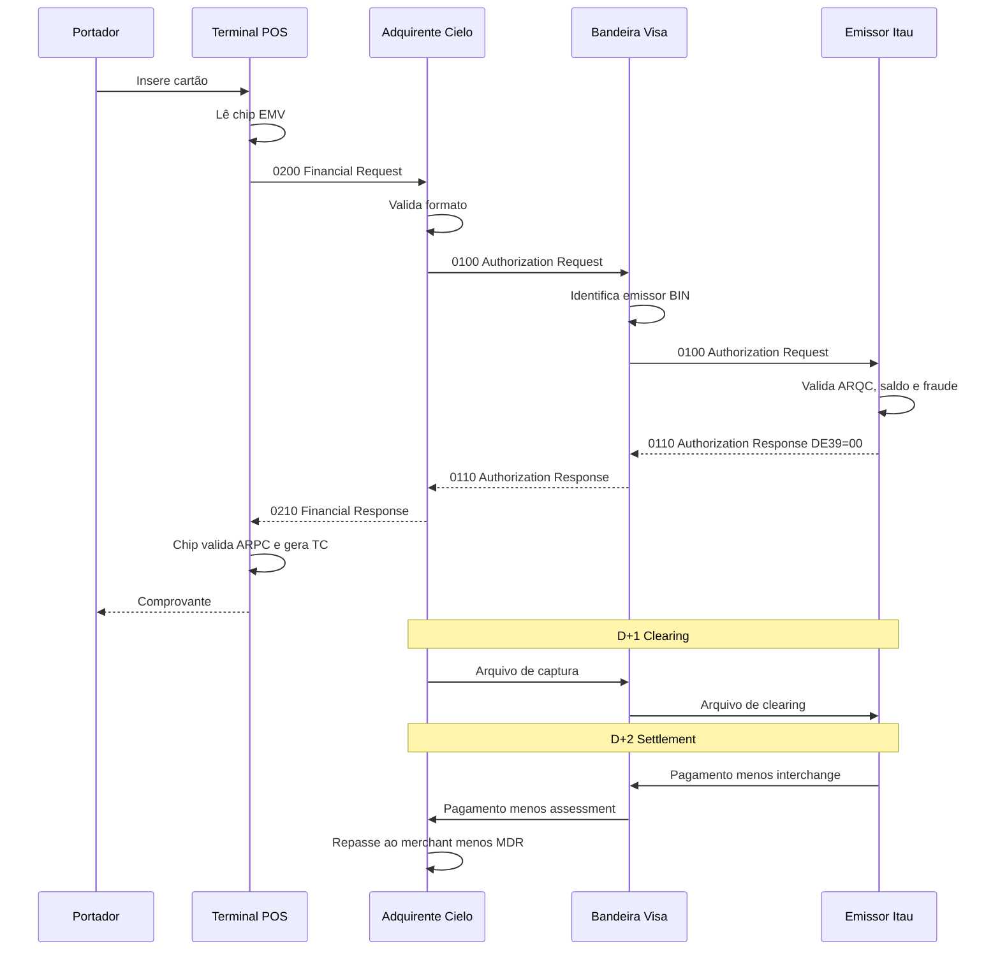

# Semana 1 — Visão Sistêmica do Ecossistema de Cartões

## Por que começar aqui?

A maioria dos desenvolvedores pula direto para "campos ISO 8583". Isso é como aprender SQL sem entender o que é um banco de dados. Antes de ver um único byte, você precisa entender **por que** essas mensagens existem, **quem** as envia e **como dinheiro realmente se move** no ecossistema de cartões.

---

## 1. Os Atores do Ecossistema

### 1.1 Modelo de 4 Partes (Four-Party Model)

Este é o modelo usado por Visa, Mastercard e Elo:

```
                    ┌─────────────┐
                    │  BANDEIRA   │
                    │ (Visa/MC/Elo)│
                    └──────┬──────┘
                           │
              Regras, switch, clearing, settlement
                           │
          ┌────────────────┼────────────────┐
          │                                  │
   ┌──────┴──────┐                    ┌──────┴──────┐
   │  ADQUIRENTE  │                    │   EMISSOR    │
   │ (Cielo, Rede,│                    │ (Itaú, BB,   │
   │  Stone)      │                    │  Nubank)     │
   └──────┬──────┘                    └──────┬──────┘
          │                                  │
   ┌──────┴──────┐                    ┌──────┴──────┐
   │  MERCHANT    │                    │ PORTADOR    │
   │ (Loja, e-com)│                    │ (Consumidor) │
   └─────────────┘                    └─────────────┘
```

**Cada ator tem um papel preciso:**

**Portador (Cardholder):**
- Pessoa física ou jurídica que possui o cartão
- Relação contratual com o emissor (contrato de cartão de crédito/débito)
- Quando passa o cartão, está pedindo ao emissor que pague o merchant por ele

**Merchant (Estabelecimento):**
- Aceita pagamento com cartão
- Relação contratual com o adquirente (contrato de credenciamento)
- Paga uma taxa (MDR) para poder aceitar cartões

**Adquirente (Acquirer):**
- Credencia o merchant (autoriza a aceitar cartões)
- Fornece ou homologa o terminal (POS)
- Captura a transação e envia para a bandeira
- Recebe o clearing e paga o merchant
- Exemplos BR: Cielo, Rede, Stone, GetNet, PagSeguro, Safrapay

**Emissor (Issuer):**
- Emite o cartão para o portador
- Aprova ou nega a transação
- Cobra o portador (fatura)
- Assume o risco de crédito
- Exemplos BR: Itaú, Bradesco, BB, Nubank, C6, Inter

**Bandeira (Card Network/Scheme):**
- Define as regras do jogo (specs, fees, certificação)
- Opera o switch central (roteia mensagens entre adquirente e emissor)
- Processa clearing e settlement
- Exemplos: Visa, Mastercard, Elo, Amex, Hiper

### 1.2 Modelo de 3 Partes (Three-Party Model)

Usado por Amex e Hiper (parcialmente):

```
   ┌─────────────┐         ┌─────────────┐
   │  MERCHANT    │         │  PORTADOR    │
   └──────┬──────┘         └──────┬──────┘
          │                       │
          └───────┬───────────────┘
                  │
           ┌──────┴──────┐
           │   AMEX/HIPER │
           │ (Emite +     │
           │  Adquire +   │
           │  Switch)     │
           └─────────────┘
```

Aqui a mesma empresa faz tudo. Na prática, Hiper/Hipercard no Itaú funciona muito próximo disso — o banco é emissor e a rede é "interna".

### 1.3 A Processadora (Processor)

Nem sempre visível, mas crítica:

```
POS → Adquirente → [PROCESSADORA] → Bandeira → [PROCESSADORA] → Emissor
```

A processadora é quem efetivamente processa a mensagem ISO 8583. Exemplos:
- **Lado adquirente:** Cielo processa para si mesma; Stone processa com infra própria
- **Lado emissor:** Itaú pode processar internamente; bancos menores terceirizam para Conductor, Pismo, etc.

---

## 2. A Jornada de uma Transação

### 2.1 Fluxo Completo — Compra Presencial com Chip

Vamos acompanhar o que acontece quando alguém compra um café de R$ 15,00 com cartão de crédito Visa emitido pelo Itaú, numa maquininha Cielo:

```
TEMPO  AÇÃO
─────  ──────────────────────────────────────────────────────

t=0    Portador insere cartão no POS da Cielo
       → POS lê dados do chip (AID, PAN, certificados)
       → Chip e terminal negociam (Application Selection)

t=1    POS monta mensagem ISO 8583
       → MTI: 0200 (Financial Request)
       → DE2: PAN do cartão
       → DE3: 003000 (compra crédito à vista)
       → DE4: 000000001500 (R$ 15,00 em centavos)
       → DE22: 051 (chip inserido, terminal com PIN)
       → DE55: dados EMV do chip (ARQC, ATC, etc.)
       → DE41: ID do terminal
       → DE42: ID do merchant (Cafeteria XYZ)

t=2    POS envia via TCP/IP para host Cielo
       → Conexão persistente (keep-alive)
       → Header de 2 bytes com tamanho + payload ISO

t=3    Host Cielo recebe, valida formato
       → Transforma 0200 em 0100 (Authorization Request)
       → Adiciona DE32 (Acquiring Institution ID = Cielo)
       → Roteia para VisaNet baseado no BIN do cartão

t=4    VisaNet (switch Visa) recebe
       → Identifica emissor pelo BIN (Itaú)
       → Roteia para host do Itaú

t=5    Host Itaú (emissor) recebe 0100
       → Valida ARQC com HSM (criptograma do chip)
       → Verifica: cartão ativo? vencido? bloqueado?
       → Verifica: limite disponível >= R$ 15,00?
       → Verifica: regras de fraude (score, geolocalização, padrão)
       → Decisão: APROVADO

t=6    Itaú monta resposta 0110
       → DE38: código de autorização (ex: "A1B2C3")
       → DE39: "00" (aprovado)
       → DE55: ARPC (resposta criptográfica para o chip)

t=7    VisaNet roteia 0110 de volta para Cielo

t=8    Cielo recebe 0110, converte para 0210
       → Envia para o POS

t=9    POS recebe 0210
       → Chip valida ARPC
       → Chip gera TC (Transaction Certificate)
       → Imprime comprovante
       → TOTAL: ~2-3 segundos para o portador

── FIM DA AUTORIZAÇÃO ──

t+D1   Cielo envia arquivo de clearing para Visa
       → "Confirmo que merchant Cafeteria XYZ capturou R$ 15,00"

t+D1   Visa processa clearing
       → Repassa arquivo para Itaú
       → Calcula interchange fee

t+D2   Settlement (liquidação financeira)
       → Itaú paga Visa → Visa paga Cielo → Cielo paga Merchant
       → Descontadas as taxas (interchange, assessment, MDR)

t+D30  Portador recebe fatura
       → R$ 15,00 aparece como "CAFETERIA XYZ"
       → Paga a fatura ou entra no rotativo
```

### 2.2 Diagrama Mermaid



---

## 3. Autorização vs Liquidação

Este é o conceito mais fundamental e que mais gera confusão:

**Autorização (Authorization):**
- Acontece em tempo real (2-3 segundos)
- Reserva o limite no cartão do portador
- Não move dinheiro de verdade
- É uma promessa: "se você capturar, eu pago"
- Protocolo: ISO 8583

**Captura (Capture):**
- Confirmação de que a venda foi efetivada
- Pode ser automática (auth + capture na mesma msg = single message)
- Ou separada (dual message: auth agora, capture depois)

**Clearing:**
- Troca de informações financeiras entre adquirente e emissor
- Acontece via bandeira em batch (D+1)
- Arquivo com todas as transações do dia
- Formato próprio (TC files Visa, IPM Mastercard)

**Settlement (Liquidação):**
- Movimentação real de dinheiro
- Emissor paga a bandeira, bandeira paga o adquirente
- Adquirente paga o merchant
- No Brasil: D+1 para débito, D+30 para crédito (ou com antecipação)

```
TEMPO ──────────────────────────────────────────────────────────>

        Autorização          Clearing           Settlement
        (real-time)          (batch D+1)        (financeiro D+2)
        ┌─────────┐         ┌──────────┐        ┌──────────┐
        │ Reserva  │   →    │ Confirma │   →    │  Move $  │
        │ limite   │        │ captura  │        │ de verdade│
        └─────────┘         └──────────┘        └──────────┘
        ISO 8583             TC/IPM files        Câmara/SPB
```

---

## 4. On-Us vs Off-Us

### 4.1 Off-Us (caminho padrão)

Adquirente e emissor são **instituições diferentes**. A mensagem passa pela bandeira:

```
POS → Cielo → VisaNet → Itaú
                 ↑
          Bandeira faz o switch
```

- Mais comum (~85% das transações)
- Maior latência (mais hops)
- Interchange fee é cobrado
- Assessment fee da bandeira é cobrado

### 4.2 On-Us

Adquirente e emissor pertencem à **mesma instituição** (ou grupo). A mensagem não precisa ir à bandeira:

```
POS → Rede (Itaú) → Itaú
         ↑
   Mesma instituição — rota direta
```

Exemplos concretos no Brasil:
- Cartão Itaú passado na maquininha Rede → **on-us**
- Cartão Hipercard passado em terminal Itaú → **on-us** (Hiper é do Itaú)
- Cartão Bradesco passado na Cielo → **off-us**

**Vantagens do on-us:**
- Latência muito menor (< 100ms vs 300-500ms)
- Sem interchange para bandeira externa
- Controle total do fluxo
- Decisão de risco integrada

**Mas atenção:** Mesmo em on-us, regras da bandeira podem exigir que a transação passe pelo switch da bandeira para fins de clearing/reporting. Depende do contrato e do arranjo.

### 4.3 Not-On-Us

Variação onde o adquirente reconhece que NÃO é on-us e roteia para fora:

```
Cielo recebe cartão Bradesco
  → BIN = Bradesco
  → Não é on-us
  → Roteia para bandeira (off-us)
```

### 4.4 Roteamento por BIN/IIN

O **BIN (Bank Identification Number)** — agora chamado **IIN (Issuer Identification Number)** — são os primeiros dígitos do cartão que identificam o emissor e a bandeira:

```
PAN: 4532 0151 1283 0366
      ↑↑↑↑ ↑↑↑↑
      BIN 8 dígitos (expansão)

Antes: BIN = 6 dígitos (453201)
Agora: BIN = 8 dígitos (45320151)
```

O switch consulta uma **tabela de BINs** para decidir:
1. Qual bandeira? (Visa, Master, Elo)
2. Qual emissor? (Itaú, Bradesco, Nubank)
3. É on-us? (emissor = minha instituição?)
4. Qual rota usar? (qual conexão TCP enviar)

---

## 5. Dual Message vs Single Message

### 5.1 Dual Message System (DMS)

A transação é dividida em **duas mensagens separadas**:

```
Mensagem 1: Authorization (0100/0110)
  → "Posso cobrar R$ 100 do cartão 4532...?"
  → "Sim, autorizado. Código A1B2C3."
  → Reserva limite de R$ 100

  [horas ou dias depois]

Mensagem 2: Clearing/Presentment
  → "Confirmo: cobrei R$ 100 (ou R$ 95) do cartão 4532..."
  → Captura efetiva
  → Pode ser valor diferente da auth (gorjeta, partial capture)
```

**Usado para:** crédito em geral, hotel, locadora, restaurante (gorjeta)
**Redes:** Visa Base I (auth) + Base II (clearing), Mastercard Banknet

### 5.2 Single Message System (SMS)

A transação é **autorização + captura em uma única mensagem**:

```
Mensagem única: Financial (0200/0210)
  → "Cobre R$ 100 do cartão 4532...?"
  → "Cobrado. Código A1B2C3."
  → Não há clearing separado (ou clearing é automático)
```

**Usado para:** débito, saque ATM, Visa Electron, Maestro
**Redes:** Visa V.I.P. (SMS), Mastercard Single Message System

### 5.3 Comparação prática

| Aspecto | Dual Message | Single Message |
|---------|-------------|----------------|
| MTI de auth | 0100/0110 | 0200/0210 |
| Captura separada? | Sim (clearing file) | Não (já capturou) |
| Permite pre-auth? | Sim | Não |
| Permite valor diferente na captura? | Sim | Não |
| Usado tipicamente para | Crédito | Débito |
| Complexidade | Maior | Menor |
| Risco de mismatch auth/clearing | Sim | Não |

---

## 6. Modelo Econômico — Como o Dinheiro Flui

### 6.1 A Cadeia de Taxas

Quando o portador paga R$ 100,00 no cartão:

```
Portador paga: R$ 100,00 na fatura
Merchant recebe: R$ 97,50 (após MDR de 2.5%)

A diferença de R$ 2,50 é dividida:
  → Emissor (Itaú):     R$ 1,50  (interchange fee)
  → Bandeira (Visa):    R$ 0,20  (assessment/network fee)
  → Adquirente (Cielo): R$ 0,80  (margem do adquirente)
```

### 6.2 MDR (Merchant Discount Rate)

Taxa total cobrada do lojista:

```
MDR = Interchange + Network Fee + Margem Adquirente

MDR típico no Brasil:
  Débito:  ~1.0 - 1.5%
  Crédito à vista: ~2.0 - 3.5%
  Crédito parcelado: ~3.0 - 5.0%+ (aumenta com número de parcelas)
```

### 6.3 Interchange

- Definido pela bandeira, pago pelo adquirente ao emissor
- No Brasil, BACEN impôs teto de **0.5% para débito** (Circular 4.739/2023)
- Crédito: em discussão regulatória
- Varia por: MCC (tipo de merchant), tipo de cartão, CP vs CNP, parcelamento

### 6.4 Por que isso importa para o técnico?

Porque **decisões técnicas impactam receita diretamente**:
- Se o switch roteia on-us quando deveria ir off-us → paga interchange desnecessariamente
- Se o roteamento por BIN está com tabela desatualizada → transações vão para a rota errada
- Se reversal falha → dinheiro fica preso
- Se clearing não bate com auth → exceções financeiras, multas da bandeira
- Performance do switch impacta aprovação → quanto mais lento, mais timeout, menos receita

---

## 7. Parcelamento — O Coração do Cartão no Brasil

### 7.1 Por que é tão importante?

No Brasil, **~70% das transações de crédito são parceladas**. Isso é uma peculiaridade brasileira que não existe na maioria dos países. Se você não domina parcelamento, não é especialista no mercado brasileiro.

### 7.2 Tipos de Parcelamento

**Parcelamento Lojista (sem juros):**
- O lojista absorve o custo financeiro
- O portador paga 3x R$ 100 = R$ 300, sem juros
- O lojista recebe R$ 300, mas em 3 parcelas (30/60/90 dias)
- Na prática, o adquirente pode antecipar os recebíveis (produto financeiro)

**Parcelamento Emissor (com juros):**
- O emissor financia
- O portador paga 3x R$ 105 = R$ 315 (com juros)
- O lojista recebe R$ 300 de uma vez
- O emissor ganha a diferença (juros)

### 7.3 Impacto na mensagem ISO 8583

O parcelamento afeta:
- **DE 3 (Processing Code):** Pode variar entre à vista e parcelado
- **DE 48 / DE 60 / DE 63 (Private Fields):** Carregam número de parcelas (varia por bandeira/adquirente)
- **Clearing:** Cada parcela gera um registro separado
- **Settlement:** Cada parcela tem data de pagamento diferente

### 7.4 Antecipação de Recebíveis

Um dos maiores produtos financeiros do Brasil em pagamentos:
- Lojista vendeu 12x → receberia em 12 meses
- Adquirente (ou banco) antecipa: paga tudo hoje com desconto
- O desconto é a taxa de antecipação
- Registradoras (CIP, TAG, CERC) registram esses recebíveis
- Portabilidade de domicílio: lojista pode escolher qual banco recebe

---

## Resumo da Semana

Após esta semana, você deve ter clareza absoluta sobre:

1. **Quem são os atores** e qual o papel de cada um
2. **A jornada completa** de uma transação (auth → clearing → settlement)
3. **On-us vs off-us** e como o roteamento por BIN funciona
4. **Dual message vs single message** e quando usar cada um
5. **O modelo econômico** (interchange, MDR, assessment)
6. **Parcelamento** como diferencial brasileiro
7. **Por que decisões técnicas impactam receita**
