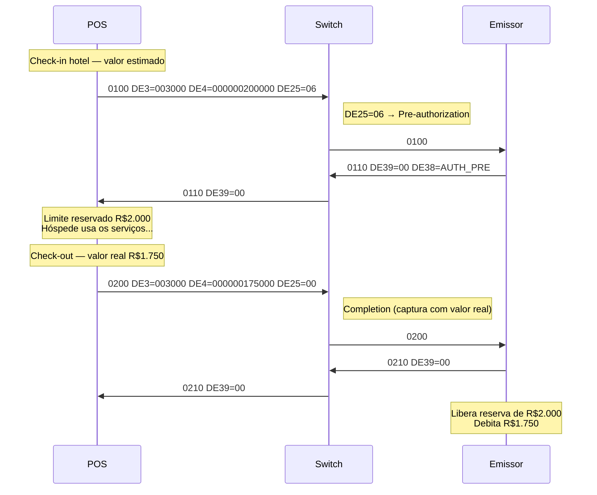

# Fase 3 — Autorização E2E (Semanas 9-12)

---

# Semana 9 — Campos Críticos da Autorização

## 1. Os 19 campos que você DEVE dominar

Não decore — **entenda o papel de cada um em negócio, risco e troubleshooting.**

### DE 2 — PAN (Primary Account Number)
- **O que é:** Número do cartão (13 a 19 dígitos)
- **Formato:** n ..19 LLVAR
- **Por que importa:** É a identidade da conta. Nunca logar completo (PCI). Mascarar: `4532****0366`
- **Troubleshooting:** PAN inválido → DE39=14. BIN não reconhecido → roteamento errado.
- **Validação:** Algoritmo de Luhn (dígito verificador)

```java
public static boolean luhnCheck(String pan) {
    int sum = 0;
    boolean alternate = false;
    for (int i = pan.length() - 1; i >= 0; i--) {
        int n = Character.getNumericValue(pan.charAt(i));
        if (alternate) {
            n *= 2;
            if (n > 9) n -= 9;
        }
        sum += n;
        alternate = !alternate;
    }
    return sum % 10 == 0;
}
```

### DE 3 — Processing Code
- **O que é:** Tipo de transação + conta origem + conta destino (6 dígitos)
- **Formato:** n 6 fixo
- **Estrutura:** `[TT][FF][TT]`
  - `TT` (pos 1-2): tipo de transação
  - `FF` (pos 3-4): tipo de conta de origem (From)
  - `TT` (pos 5-6): tipo de conta de destino (To)

**Tipos de transação (primeiros 2 dígitos):**
```
00 = Compra (purchase)
01 = Saque (cash withdrawal)
09 = Compra + saque (purchase with cashback)
20 = Estorno / refund
28 = Pagamento (payment)
30 = Consulta de saldo (balance inquiry)
40 = Verificação de conta
```

**Tipos de conta (dígitos 3-4 e 5-6):**
```
00 = Default / não especificado
10 = Poupança (savings)
20 = Conta corrente (checking)
30 = Crédito (credit)
```

**Valores que você vai ver em produção — Crédito:**
```
003000 = Compra crédito à vista             (purchase, from credit, to default)
003030 = Compra crédito (algumas redes)     (purchase, from credit, to credit)
200030 = Estorno crédito                    (refund, from default, to credit)
```

**Valores que você vai ver em produção — Débito:**
```
002000 = Compra débito conta corrente       (purchase, from checking, to default)
001000 = Compra débito poupança             (purchase, from savings, to default)
012000 = Saque conta corrente               (withdrawal, from checking, to default)
011000 = Saque poupança                     (withdrawal, from savings, to default)
092000 = Compra + saque conta corrente      (purchase+cash, from checking, to default)
200020 = Estorno débito corrente            (refund, from default, to checking)
200010 = Estorno débito poupança            (refund, from default, to savings)
```

**Outros:**
```
300000 = Consulta de saldo (default)
302000 = Consulta de saldo corrente
301000 = Consulta de saldo poupança
```

> **Atenção:** O DE3 é a principal forma de diferenciar débito de crédito no protocolo.
> Ao receber uma mensagem, seu switch DEVE ler este campo para aplicar regras distintas
> de timeout, PIN, roteamento e liquidação.

### DE 4 — Amount, Transaction
- **O que é:** Valor em centavos, 12 dígitos, pad zero à esquerda
- **Formato:** n 12 fixo
- **Exemplo:** R$ 150,00 → `000000015000`
- **Armadilha:** Sempre em centavos! R$ 1,50 ≠ R$ 150,00. Já vi incidente por confundir.

### DE 7 — Transmission Date and Time
- **Formato:** n 10 fixo (MMDDhhmmss)
- **Uso:** Timestamp da transmissão. Parte da chave de correlação em algumas implementações.

### DE 11 — STAN (Systems Trace Audit Number)
- **Formato:** n 6 fixo (000001 a 999999)
- **Uso:** Identificador da transação dentro de uma sessão/terminal
- **Crítico:** STAN é a principal chave de correlação. Deve ser único na janela de timeout.
- **Rollover:** Com 6 dígitos, volta ao 000001 após 999999. Em alto volume, pode reutilizar rápido.

### DE 22 — POS Entry Mode
- **Formato:** n 3 fixo `[PP][C]`
- **PP = PAN Entry Mode:**

```
01 = Manual (digitado)
02 = Tarja magnética
05 = Chip contact (inserido)
07 = Contactless chip (NFC)
10 = Credential on File
80 = Fallback (chip falhou, usou tarja)
81 = E-commerce
82 = E-commerce com 3DS
91 = Contactless tarja (MSD)
```

- **C = PIN Capability:** 1 = terminal aceita PIN, 2 = não aceita

**Por que importa pra fraude:** DE22=051 (chip+PIN) é muito mais seguro que DE22=012 (tarja sem PIN). Regras de risco e interchange mudam baseado neste campo.

### DE 25 — POS Condition Code
- **Formato:** n 2 fixo

```
00 = Normal presentation (compra padrão)
06 = Pre-authorization
08 = Mail/telephone order
59 = E-commerce
```

### DE 18 — Merchant Type (MCC — Merchant Category Code)
- **Formato:** n 4 fixo
- **O que é:** Categoriza o tipo de negócio do merchant (padrão ISO 18245)
- **Por que importa:**

```
MCC define:
  1. Taxa de interchange (restaurante ≠ supermercado)
  2. Regras de benefício/voucher: VA só em supermercado, VR só em restaurante
  3. Regras de risco: cassinos, viagens = alto risco
  4. Benefícios do portador: cashback duplo em posto, milhas em companhia aérea
```

**MCCs comuns no Brasil:**
```
5411 = Grocery Stores, Supermarkets       → Vale Alimentação ✓
5499 = Misc Food Stores                   → VA e VR ✓
5812 = Eating Places, Restaurants         → Vale Refeição ✓
5814 = Fast Food Restaurants              → Vale Refeição ✓
5541 = Service Stations (Gas Stations)    → Vale Combustível ✓
5912 = Drug Stores and Pharmacies         → Benefícios saúde
7011 = Hotels and Motels                  → Pre-auth obrigatório
7512 = Car Rental Agencies                → Pre-auth obrigatório
4111 = Transportation Commuter            → Vale Transporte (onde aplicável)
```

**Troubleshooting:** DE39=57 (Transaction not permitted) frequentemente é causado por MCC cadastrado errado para o tipo de benefício.

### DE 32 — Acquiring Institution ID
- **Formato:** n ..11 LLVAR
- **Uso:** Identifica o adquirente. Usado no roteamento de volta (response) e no clearing.

### DE 37 — Retrieval Reference Number (RRN)
- **Formato:** an 12 fixo
- **Uso:** Referência única para rastreio. Merchant usa para consultar status.
- **Diferença do STAN:** STAN é operacional (correlação request/response). RRN é para rastreio de negócio.

### DE 38 — Authorization Identification Response
- **Formato:** an 6 fixo
- **Uso:** Código de autorização gerado pelo emissor. Impresso no comprovante.
- **Só existe na response** (0110/0210).

### DE 39 — Response Code ★
- **Formato:** an 2 fixo
- **O campo mais importante da response.** Diz se aprovou, negou, e por quê.

```
00 = Approved
01 = Refer to card issuer
03 = Invalid merchant
05 = Do not honor (genérico)
12 = Invalid transaction
13 = Invalid amount
14 = Invalid card number (Luhn fail)
30 = Format error ← PROBLEMA NO SEU SISTEMA
41 = Lost card (reter)
43 = Stolen card (reter)
51 = Insufficient funds
54 = Expired card
55 = Incorrect PIN
57 = Transaction not permitted to cardholder
58 = Transaction not permitted to terminal
59 = Suspected fraud
61 = Exceeds withdrawal limit
65 = Exceeds withdrawal frequency limit
68 = Response received too late ← TIMEOUT
75 = Allowable PIN tries exceeded
76 = Unable to locate previous message ← REVERSAL de transação não encontrada
91 = Issuer unavailable ← EMISSOR FORA
96 = System malfunction
```

### DE 41 — Card Acceptor Terminal Identification
- **Formato:** ans 8 fixo
- **Uso:** Identifica o terminal (POS/ATM). Parte da chave de correlação.

### DE 42 — Card Acceptor Identification Code
- **Formato:** ans 15 fixo
- **Uso:** Identifica o merchant (establishment). Aparece na fatura.

### DE 43 — Card Acceptor Name/Location
- **Formato:** ans 40 fixo
- **Uso:** Nome e localização do merchant — é o que aparece no extrato do portador
- **Estrutura típica:** `NOME LOJA        CIDADE BR`
- **Por que importa:** Friendly fraud começa quando o portador não reconhece este nome.
  Um nome vago como "TECH SOLUTIONS" gera muito mais chargeback que "AMAZON.COM.BR".

### DE 48 — Additional Data — Private Use ★
- **Formato:** ans ...999 LLLVAR
- **Uso:** Campo livre para dados privados entre partes da rede. Muito usado no Brasil.
- **Conteúdo varia por rede/adquirente**, mas padrões comuns:

**Parcelamento (formato típico adquirentes BR):**
```
Byte 1-2: tipo de parcelamento
  "01" = parcelamento pelo lojista (sem juros)
  "02" = parcelamento pelo emissor (com juros)

Byte 3-4: número de parcelas
  "03" = 3x, "12" = 12x

Exemplo completo: "0103" = parcelamento lojista em 3x
                  "0212" = parcelamento emissor em 12x
```

**Dados EMV adicionais:**
```
// Quando DE55 não é suficiente, dados extras vêm no DE48
```

**Subtag structures (alguns adquirentes usam TLV dentro do DE48):**
```java
// Montando DE48 com dados de parcelamento
public String buildDE48Installment(int parcelas, boolean lojista) {
    String tipo = lojista ? "01" : "02";
    return String.format("%s%02d", tipo, parcelas);
}

// Lendo DE48
public InstallmentInfo parseDE48(String de48) {
    if (de48 == null || de48.length() < 4) return null;
    String tipo = de48.substring(0, 2);
    int parcelas = Integer.parseInt(de48.substring(2, 4));
    return new InstallmentInfo(parcelas, "01".equals(tipo));
}
```

> **Atenção PCI:** Nunca coloque dados sensíveis (CVV, track data) em DE48. É texto livre e pode aparecer em logs.

### DE 49 — Currency Code, Transaction
- **Formato:** n 3 fixo
- **Valores:** 986 = BRL, 840 = USD, 978 = EUR
- **ISO 4217:** Código numérico da moeda

### DE 52 — PIN Data
- **Formato:** b 8 fixo (64 bits)
- **Uso:** PIN Block criptografado (nunca em claro!)
- **Presente apenas se:** terminal capturou PIN e transação exige

### DE 55 — ICC System Related Data (EMV)
- **Formato:** b ..999 LLLVAR
- **Uso:** Dados do chip no formato TLV (Tag-Length-Value)
- **Presente se:** DE22 indica chip (05, 07)

---

## 2. Exercícios Semana 9

### Exercício 1 — Flash cards
Crie flash cards (digital ou papel) com os 19 campos. Frente: número e nome. Verso: formato, uso, e um exemplo de valor.

### Exercício 2 — Dado um dump, extraia significado
```
MTI=0200 DE2=4532015112830366 DE3=003000 DE4=000000150000 
DE7=0314160000 DE11=000042 DE22=071 DE25=00 DE39= 
DE41=TERM0001 DE42=MERCHANT00001   DE49=986 DE55=[TLV data]
```

Responda:
1. Que tipo de transação é?
2. Qual o valor?
3. Como o cartão foi lido?
4. Tem PIN?
5. É e-commerce?
6. Esse é request ou response? Como sabe?

### Exercício 3 — Validador de mensagem
Implemente `MessageValidator.java` que recebe `ISOMsg` e retorna lista de erros:
- PAN com Luhn inválido
- Amount zero ou negativo
- Processing Code desconhecido
- POS Entry Mode inválido
- Campos obrigatórios ausentes por MTI

### Desafio — Análise de incidente
O time de operações reporta: "Taxa de decline subiu de 3% para 25% nos últimos 30 minutos. Apenas terminais novos (TERM0100 a TERM0150)."

Investigue dado que o dump mostra:
```
DE22=012  (tarja magnética, sem PIN)
DE55=[presente com dados EMV]
```

O que está errado? Qual o impacto? Como corrigir?

---

# Semana 10 — 0200/0210 Ponta a Ponta

## 1. Fluxo completo implementado

```java
// Participant: ForwardToIssuer
public class ForwardToIssuer implements TransactionParticipant {
    
    private QMUX mux; // injetado via configuração
    private long timeout = 30000;

    @Override
    public int prepare(long id, Serializable context) {
        Context ctx = (Context) context;
        ISOMsg request = ctx.get("REQUEST");
        String destination = ctx.get("DESTINATION_MUX");
        
        try {
            // Converte 0200 → 0100 se necessário (adquirente → bandeira)
            ISOMsg authRequest = convertToAuthRequest(request);
            
            // Envia via QMUX e aguarda response
            ISOMsg response = mux.request(authRequest, timeout);
            
            if (response == null) {
                // TIMEOUT — nenhuma resposta
                ctx.put("TIMEOUT", true);
                ctx.put("RESPONSE_CODE", "68");
                ctx.put("NEEDS_REVERSAL", true);
                return ABORTED; // Vai pro abort, que gera reversal
            }

            ctx.put("RESPONSE", response);
            ctx.put("RESPONSE_CODE", response.getString(39));
            return PREPARED;

        } catch (Exception e) {
            ctx.put("RESPONSE_CODE", "96");
            return ABORTED;
        }
    }

    /**
     * Converte a mensagem de request para o MTI correto ao encaminhar para a rede.
     *
     * Fluxo single message (débito):  0200 → envia 0200 direto para o emissor
     * Fluxo dual message (crédito):   0200 chega do terminal → converte para 0100 ao enviar para bandeira
     *                                 A captura (0220) é enviada depois, na liquidação
     *
     * O tipo de fluxo é determinado pelo DE3 (Processing Code):
     *   from-account "20" (corrente) ou "10" (poupança) = débito = single message
     *   from-account "30" (crédito) ou "00" (default) = crédito = dual message
     */
    private ISOMsg convertToAuthRequest(ISOMsg original) throws ISOException {
        ISOMsg req = (ISOMsg) original.clone();
        String mti = original.getMTI();
        String de3 = original.getString(3);
        String fromAccount = (de3 != null && de3.length() >= 4) ? de3.substring(2, 4) : "00";

        if ("0200".equals(mti)) {
            boolean isSingleMessage = "20".equals(fromAccount) || "10".equals(fromAccount);
            if (!isSingleMessage) {
                // Crédito: adquirente converte 0200 em 0100 para enviar à bandeira/emissor
                req.setMTI("0100");
            }
            // Débito: mantém 0200 (single message, autorização = captura)
        }
        return req;
    }
}
```

## 2. Regras de aprovação (no emissor simulado)

```java
public class IssuerSimulator implements ISORequestListener {
    
    @Override
    public boolean process(ISOSource source, ISOMsg request) {
        ISOMsg response = (ISOMsg) request.clone();
        response.setResponseMTI();
        
        String pan = request.getString(2);
        long amount = Long.parseLong(request.getString(4));
        
        // Regras de decisão
        String responseCode = decide(pan, amount, request);
        response.set(39, responseCode);
        
        if ("00".equals(responseCode)) {
            response.set(38, generateAuthCode()); // Authorization ID
        }
        
        source.send(response);
        return true;
    }
    
    private String decide(String pan, long amount, ISOMsg msg) {
        // Simula regras reais
        if (pan.startsWith("400000000000")) return "14"; // PAN inválido
        if (pan.startsWith("410000000000")) return "51"; // Sem saldo
        if (pan.startsWith("420000000000")) return "54"; // Expirado
        if (pan.startsWith("430000000000")) return "55"; // PIN errado
        if (amount > 1000000) return "61";                // Acima do limite
        if (isBlocked(pan)) return "05";                   // Do not honor
        return "00"; // Aprovado
    }
}
```

## 3. Exercícios Semana 10

1. **Implemente o fluxo completo** 0200 → processamento → 0210
2. **Crie o IssuerSimulator** com pelo menos 8 regras de decline
3. **Teste cada response code** individualmente
4. **Teste o happy path** end-to-end: terminal → switch → issuer → switch → terminal

### Desafio
Implemente métricas que mostrem em tempo real:
- Taxa de aprovação por minuto
- Top 5 response codes
- Latência P50, P95, P99
- Volume de transações por terminal

---

# Semana 11 — On-Us/Off-Us + Roteamento + Parcelamento

## 1. Routing Engine

```java
public class RouteByBIN implements TransactionParticipant {

    private final BINTable binTable;

    @Override
    public int prepare(long id, Serializable context) {
        Context ctx = (Context) context;
        ISOMsg msg = ctx.get("REQUEST");
        String pan = msg.getString(2);
        
        // 8-digit BIN (padrão atual)
        String bin = pan.substring(0, Math.min(8, pan.length()));
        
        Route route = binTable.lookup(bin);
        if (route == null) {
            // Tenta fallback com 6-digit BIN
            route = binTable.lookup(pan.substring(0, 6));
        }
        if (route == null) {
            ctx.put("RESPONSE_CODE", "92"); // Routing error
            return ABORTED;
        }
        
        ctx.put("ROUTE", route);
        ctx.put("IS_ON_US", route.isOnUs());
        ctx.put("DESTINATION_MUX", route.getMuxName());
        ctx.put("NETWORK", route.getNetwork()); // VISA, MASTERCARD, ELO
        
        return PREPARED;
    }
}
```

## 2. Tabela de BINs

```java
public class BINTable {
    // bin_prefix → Route
    private final TreeMap<String, Route> routes = new TreeMap<>();
    
    public void addRoute(String binPrefix, Route route) {
        routes.put(binPrefix, route);
    }
    
    public Route lookup(String bin) {
        // Longest prefix match
        Map.Entry<String, Route> entry = routes.floorEntry(bin);
        if (entry != null && bin.startsWith(entry.getKey())) {
            return entry.getValue();
        }
        return null;
    }
}

public record Route(
    String binPrefix,
    String issuerName,
    String network,        // VISA, MASTERCARD, ELO
    boolean onUs,
    String muxName,        // nome do QMUX destino
    String fallbackMux     // QMUX alternativo
) {}
```

## 3. Parcelamento na mensagem

```java
// Campos privados para parcelamento (varia por adquirente/bandeira)
// Exemplo típico usando DE 48 ou DE 60

public class InstallmentData {
    private int numberOfInstallments;  // 2-99
    private InstallmentType type;      // LOJISTA, EMISSOR
    
    // Serializa para campo privado
    public String toDE48() {
        // Formato típico: "03" + tipo + quantidade
        return String.format("03%s%02d",
            type == InstallmentType.LOJISTA ? "1" : "2",
            numberOfInstallments);
    }
}

// No ISOMsg:
msg.set(48, installmentData.toDE48());  // Adiciona info de parcelas
```

## 4. Exercícios Semana 11

1. **Implemente BINTable** com pelo menos 20 BINs (5 on-us, 15 off-us, 3 bandeiras)
2. **Implemente RouteByBIN participant** com fallback 8→6 dígitos
3. **Teste roteamento**: on-us vai para mux local, off-us vai para mux da bandeira
4. **Implemente parcelamento**: 3x, 6x, 12x nos campos privados
5. **Teste: BIN não encontrado** → response code 92

### Desafio
Simule o cenário de BIN expansion: um cartão que antes tinha BIN 6 dígitos `453201` agora precisa ser roteado com 8 dígitos `45320151`. Demonstre que a tabela antiga (6 dígitos) roteia para o destino ERRADO e a tabela nova (8 dígitos) roteia corretamente.

---

# Semana 12 — Timeout, Stand-in e Resiliência

## 1. Estratégia de Timeout

```
SLAs de timeout por tipo:
  Authorization: 30 segundos (configurável)
  Reversal: 45 segundos (mais tolerante — precisa da confirmação)
  Network Management: 15 segundos (rápido)
  
Timeout no QMUX → retorna null
Ação: auto-reversal + response com DE39=68
```

## 2. Stand-In Processing (STIP)

Quando o emissor está indisponível, a **bandeira decide** (stand-in):
- Visa e Mastercard mantêm parâmetros do emissor
- Se o emissor não responde, a bandeira pode aprovar/negar baseada em regras pré-definidas
- O emissor é avisado depois (via advice)

**Seu switch deve saber diferenciar:**
- Resposta direta do emissor (DE39 vem do emissor)
- Resposta de stand-in (DE39 vem da bandeira)

## 3. Exercícios Semana 12

1. **Implemente auto-reversal por timeout** no switch
2. **Simule emissor lento** (responde em 35s com timeout de 30s)
3. **Simule emissor fora** (não responde nunca)
4. **Documente `timeout-strategy.md`** com SLAs, decisões e rationale

### Desafio
Monte um cenário de stress: envie 100 transações simultâneas para o switch. O emissor simulado responde:
- 70% em < 200ms (normal)
- 20% em 5-10s (lento)
- 10% nunca responde (timeout)

Analise: quantas aprovadas? Quantas com timeout? Quantos reversals gerados? Qual a latência P50/P95/P99?

---

# Outros Fluxos Essenciais

## Estorno (Refund) vs Reversal — Diferença crítica

Esta é uma das confusões mais comuns em times de desenvolvimento. **São mecanismos completamente diferentes.**

| | Reversal (0400/0420) | Refund/Estorno (0200 com DE3=20xxxx) |
|---|---|---|
| **Quando** | Falha técnica (timeout, erro) | Devolução voluntária (cliente desistiu) |
| **Quem inicia** | Switch/adquirente automaticamente | Merchant inicia no POS/sistema |
| **Timing** | Antes do clearing (mesma sessão) | Dias/semanas após a transação original |
| **Impacto no clearing** | Transação não entra no clearing | Nova transação de crédito ao portador |
| **Referência original** | DE 90 obrigatório (dados originais) | RRN referenciando original (opcional em alguns) |
| **MTI** | 0400 (request) / 0410 (response) | 0200 (novo request) / 0210 (response) |
| **DE3** | Mesmo da original | `200030` (crédito) / `200020` (débito) |

### Fluxo de Refund/Estorno

```
Compra original (D+0):
  POS → Switch: 0200 DE3=003000 DE4=000000050000 DE37=RRN123456
  Switch → Emissor: 0200
  Emissor → Switch: 0210 DE39=00 DE38=AUTH01
  POS ← Switch: 0210 DE39=00

Estorno (D+5, merchant decide devolver):
  POS → Switch: 0200 DE3=200030 DE4=000000050000 DE37=RRNestorno01
                     (valor pode ser parcial — partial refund)
  Switch → Emissor: 0200
  Emissor → Switch: 0210 DE39=00  ← credita o portador
  POS ← Switch: 0210 DE39=00 (comprovante "ESTORNO APROVADO")
```

```java
// Montando mensagem de estorno
public ISOMsg buildRefund(ISOMsg originalTxn, long refundAmount) throws ISOException {
    ISOMsg refund = new ISOMsg();
    refund.setMTI("0200");
    refund.set(2, originalTxn.getString(2));  // mesmo PAN
    refund.set(3, "200030");                   // DE3 = estorno crédito
    refund.set(4, String.format("%012d", refundAmount)); // valor do estorno
    refund.set(11, generateSTAN());            // novo STAN
    refund.set(37, generateRRN());             // novo RRN
    refund.set(41, originalTxn.getString(41)); // mesmo terminal
    refund.set(42, originalTxn.getString(42)); // mesmo merchant
    refund.set(49, originalTxn.getString(49)); // mesma moeda

    // Referência à transação original (boas práticas, pode ser via DE48 ou DE62)
    // Verificar requisito da rede
    return refund;
}
```

**Partial Refund:** O valor do estorno pode ser menor que o original. Ex: cliente devolveu 1 item de 3 → refund de R$50 de uma compra de R$150.

---

## Pre-autorização (Pre-auth)

Usada quando o valor final não é conhecido no momento do check-in: hotéis, locadoras, postos de combustível com pré-pagamento.

### Fluxo completo de pre-auth



**Pontos críticos:**
- DE25=06 sinaliza pre-auth (authorization only, não captura)
- O valor final pode ser **menor OU maior** que o pré-autorizado (regras variam por rede — Visa permite +15% em hotel, +25% em locadora)
- Pre-auth expira em 7 dias (padrão) — depois o limite é liberado automaticamente
- Se o merchant não fizer a completion (0200), o portador fica com limite bloqueado — causa chargeback!

```java
// Verificando se é pre-auth pelo DE25
public boolean isPreAuth(ISOMsg msg) throws ISOException {
    return "06".equals(msg.getString(25));
}

// Verificando se é completion de pre-auth
public boolean isPreAuthCompletion(ISOMsg msg) throws ISOException {
    String mti = msg.getMTI();
    String de25 = msg.getString(25);
    // Completion: 0200 com DE25=00 (ou sem DE25)
    return "0200".equals(mti) && (de25 == null || "00".equals(de25));
}
```

**Incremental Authorization (hotels, delivery):**
Algumas redes (Visa, Mastercard) permitem aumentar o valor pré-autorizado via novas 0100 com referência ao auth original, sem novo pre-auth completo.

---

## Saque (Cash Withdrawal) e Cashback

### Saque em ATM — Single message

```
0200 com:
  DE3 = 012000 (saque conta corrente) ou 011000 (poupança)
  DE4 = valor do saque
  DE52 = PIN Block (obrigatório)
  DE18 = 6011 (MCC de ATM) ou 6010 (branch)

Fluxo:
  ATM → Switch: 0200 DE3=012000 DE52=[PIN]
  Switch → Emissor: 0200
  Emissor verifica saldo + PIN → 0210 DE39=00
  ATM dispensa o dinheiro → imprime comprovante

Se ATM dispensou mas não recebeu 0210:
  → Gera reversal 0420 ANTES de dispensar novamente
  → Se já dispensou: log de exceção, reconciliação manual
```

### Cashback (compra + saque)

```
0200 com:
  DE3 = 092000 (purchase + cash, from checking)
  DE4 = valor TOTAL (compra + saque)
  DE54 = valor do saque separado (Additional Amounts)
  DE52 = PIN obrigatório

Exemplo: Compra R$100 + R$50 cashback = DE4=150,00 + DE54=50,00
```

```java
// DE54 — Additional Amounts (para cashback)
// Formato: [Account Type 2][Amount Type 2][Currency 3][X 1][Amount 12]
// Exemplo: "202986C000000005000" = corrente, cash, BRL, crédito, R$50,00
public String buildDE54Cashback(long cashbackAmount, String currency) {
    return String.format("202%sC%012d", currency, cashbackAmount);
}
```

---

## Consulta de Saldo (Balance Inquiry)

```
0200 com:
  DE3 = 300000 (saldo default) ou 302000 (corrente) ou 301000 (poupança)
  DE4 = 000000000000 (zero — não há valor na transação)
  DE52 = PIN (obrigatório em ATM)

Response (0210):
  DE39 = 00
  DE54 = saldo disponível
  (alguns emissores usam campo privado para saldo)
```

---

# Débito vs Crédito na Prática

## 1. Diferenças fundamentais

| Dimensão | Crédito | Débito |
|---|---|---|
| **Processing Code (DE3)** | `003000` (à vista) | `002000` (corrente) / `001000` (poupança) |
| **Modelo de mensagem** | Dual message (auth + capture separados) | Single message (auth + capture juntos) |
| **PIN online** | Opcional (assinatura ou PIN) | Obrigatório na grande maioria |
| **DE52 (PIN Data)** | Ausente em compras com assinatura | Presente (PIN Block criptografado) |
| **Liquidação** | D+1 a D+30 (parcelado) | D+0 ou D+1 |
| **Interchange (BR)** | 0,5% a 1,7% (por produto) | Limitado a 0,5% (Circular BACEN) |
| **Risco de chargeback** | EMV liability shift se não usar chip | Sem PIN → rede assume; com PIN → emissor |
| **Timeout** | 30s (mais tolerante) | 15-20s (debitado imediatamente) |

---

## 2. Dual Message (Crédito)

O crédito separa autorização de captura em duas etapas:

```
Passo 1 — Autorização (reserva de limite):
  POS → Adquirente: 0100 (auth request)
  Adquirente → Bandeira: 0100
  Bandeira → Emissor: 0100
  Emissor → Bandeira: 0110 (DE39=00, DE38=auth_code)
  Resposta volta ao POS

Passo 2 — Captura (confirmação financeira):
  Adquirente → Bandeira: 0220 (advice de captura)
  Bandeira → Emissor: 0220 (avisa que a venda foi confirmada)
  Emissor: 0230 (confirma recebimento)
  → Agora a transação entra no clearing

Entre os dois passos, o limite do portador está RESERVADO (não debitado).
```

**Quando a captura não vem:** Autorização expira em 7 dias (Visa/Master padrão).
O limite reservado é liberado automaticamente.

```java
// Exemplo de 0220 (Capture/Advice) no jPOS
ISOMsg capture = new ISOMsg();
capture.setMTI("0220");
capture.set(2, originalRequest.getString(2));   // mesmo PAN
capture.set(3, originalRequest.getString(3));   // mesmo Processing Code
capture.set(4, originalRequest.getString(4));   // mesmo valor
capture.set(11, originalRequest.getString(11)); // mesmo STAN
capture.set(38, authCode);                      // auth code da 0110
capture.set(39, "00");
// DE60 ou DE48: dados de captura específicos da bandeira
```

---

## 3. Single Message (Débito)

O débito autoriza e captura em uma única mensagem — o dinheiro sai imediatamente:

```
POS → Adquirente: 0200 (auth + capture request)
  DE3 = 002000 (débito corrente) ou 001000 (débito poupança)
  DE52 = [PIN Block criptografado]

Adquirente → Emissor: 0200
Emissor debita a conta na hora → 0210 (DE39=00)
Resposta volta ao POS → comprovante impresso

→ Não há etapa de captura separada.
→ Se houver erro após aprovação, precisa de reversal 0420.
```

**Implicação crítica:** Em débito, o reversal é URGENTE. O cliente já foi debitado.
Um reversal tardio causa reclamação imediata.

---

## 4. PIN online — obrigatório em débito

```java
// Verificação se PIN está presente quando obrigatório
public class ValidatePINPresence implements TransactionParticipant {

    @Override
    public int prepare(long id, Serializable context) {
        Context ctx = (Context) context;
        ISOMsg msg = ctx.get("REQUEST");

        String processingCode = msg.getString(3);
        boolean isDebit = processingCode != null &&
            (processingCode.startsWith("00" + "20") ||  // corrente
             processingCode.startsWith("00" + "10"));   // poupança

        if (isDebit) {
            // Débito: PIN obrigatório (exceto contactless abaixo do limite sem PIN)
            String entryMode = msg.getString(22);
            boolean isContactlessLowValue = "07".equals(entryMode) || "91".equals(entryMode);
            boolean pinPresent = msg.hasField(52);

            if (!isContactlessLowValue && !pinPresent) {
                ctx.put("RESPONSE_CODE", "55"); // Incorrect PIN / PIN required
                return ABORTED;
            }
        }

        return PREPARED;
    }
}
```

---

## 5. Roteamento diferenciado por modalidade

O switch precisa aplicar regras diferentes conforme o tipo:

```java
public class RouteByModalidade implements TransactionParticipant {

    @Override
    public int prepare(long id, Serializable context) {
        Context ctx = (Context) context;
        ISOMsg msg = ctx.get("REQUEST");

        String de3 = msg.getString(3);
        Modalidade modalidade = detectarModalidade(de3);

        ctx.put("MODALIDADE", modalidade);

        switch (modalidade) {
            case CREDITO_A_VISTA:
                ctx.put("TIMEOUT_MS", 30_000L);
                ctx.put("MODELO_MENSAGEM", "DUAL");
                ctx.put("PIN_OBRIGATORIO", false);
                break;

            case CREDITO_PARCELADO:
                ctx.put("TIMEOUT_MS", 30_000L);
                ctx.put("MODELO_MENSAGEM", "DUAL");
                ctx.put("PIN_OBRIGATORIO", false);
                ctx.put("REQUER_CAMPOS_PARCELAMENTO", true);
                break;

            case DEBITO_CORRENTE:
            case DEBITO_POUPANCA:
                ctx.put("TIMEOUT_MS", 20_000L);
                ctx.put("MODELO_MENSAGEM", "SINGLE");
                ctx.put("PIN_OBRIGATORIO", true);
                ctx.put("LIQUIDACAO_IMEDIATA", true);
                break;

            default:
                ctx.put("RESPONSE_CODE", "12"); // Invalid transaction
                return ABORTED;
        }

        return PREPARED;
    }

    private Modalidade detectarModalidade(String de3) {
        if (de3 == null || de3.length() < 4) return Modalidade.DESCONHECIDO;
        String txType = de3.substring(0, 2);
        String fromAccount = de3.substring(2, 4);

        if ("00".equals(txType)) {
            return switch (fromAccount) {
                case "30" -> Modalidade.CREDITO_A_VISTA;
                case "20" -> Modalidade.DEBITO_CORRENTE;
                case "10" -> Modalidade.DEBITO_POUPANCA;
                default -> Modalidade.DESCONHECIDO;
            };
        }
        return Modalidade.DESCONHECIDO;
    }
}

enum Modalidade {
    CREDITO_A_VISTA, CREDITO_PARCELADO,
    DEBITO_CORRENTE, DEBITO_POUPANCA,
    DESCONHECIDO
}
```

---

## 6. Liquidação e settlement por modalidade

```
CRÉDITO À VISTA:
  Auth (D+0) → Clearing enviado (D+1) → Lojista recebe (D+1 a D+2)
  Portador paga na fatura (até D+30)

CRÉDITO PARCELADO:
  Auth (D+0) → Cada parcela liquidada mensalmente
  Lojista: pode antecipar recebíveis com desconto

DÉBITO:
  Auth + Capture (D+0) → Conta debitada na hora
  Lojista: recebe em D+1 (ou mesmo dia em alguns arranjos)
  Portador: saldo já reduzido imediatamente
```

---

## 7. Diferenças no IssuerSimulator

```java
public class IssuerSimulator implements ISORequestListener {

    @Override
    public boolean process(ISOSource source, ISOMsg request) throws Exception {
        ISOMsg response = (ISOMsg) request.clone();
        response.setResponseMTI();

        String de3 = request.getString(3);
        String fromAccount = de3 != null && de3.length() >= 4 ? de3.substring(2, 4) : "00";

        String responseCode;
        if ("30".equals(fromAccount)) {
            // CRÉDITO: verifica limite disponível
            responseCode = avaliarCredito(request);
        } else if ("20".equals(fromAccount) || "10".equals(fromAccount)) {
            // DÉBITO: verifica saldo da conta + PIN
            responseCode = avaliarDebito(request, fromAccount);
        } else {
            responseCode = "12"; // Invalid transaction
        }

        response.set(39, responseCode);
        if ("00".equals(responseCode)) {
            response.set(38, generateAuthCode());
        }

        source.send(response);
        return true;
    }

    private String avaliarCredito(ISOMsg msg) throws ISOException {
        long amount = Long.parseLong(msg.getString(4));
        String pan = msg.getString(2);
        // Limite de crédito simulado
        long limiteDisponivel = getLimiteCredito(pan);
        if (amount > limiteDisponivel) return "51"; // Insufficient funds (limite)
        return "00";
    }

    private String avaliarDebito(ISOMsg msg, String accountType) throws ISOException {
        long amount = Long.parseLong(msg.getString(4));
        String pan = msg.getString(2);

        // PIN obrigatório para débito
        if (!msg.hasField(52)) return "55"; // Incorrect PIN (ausente)

        // Valida PIN (em produção: decripta e verifica com HSM)
        if (!validatePINBlock(msg.getBytes(52), pan)) return "55";

        // Saldo da conta
        long saldo = getSaldoConta(pan, accountType);
        if (amount > saldo) return "51"; // Insufficient funds (saldo)

        return "00";
    }
}
```

---

## 8. Exercícios — Débito vs Crédito

### Exercício 1 — DE3 na prática
Para cada transação abaixo, escreva o Processing Code correto:
1. Compra com cartão de débito, conta corrente
2. Compra com crédito à vista
3. Saque no caixa eletrônico, conta poupança
4. Estorno de compra débito corrente
5. Consulta de saldo, conta corrente
6. Compra com cashback, débito corrente

### Exercício 2 — Detectar modalidade
Receba um `ISOMsg` e retorne uma string descritiva:
- `"CREDITO_A_VISTA"`, `"CREDITO_PARCELADO"`, `"DEBITO_CORRENTE"`, `"DEBITO_POUPANCA"`, `"SAQUE"`, `"ESTORNO"`, `"OUTRO"`

### Exercício 3 — Dual message E2E
Implemente o fluxo completo de crédito à vista:
1. Envie 0200 com `DE3=003000`
2. Switch processa e retorna 0210 aprovado
3. Envie 0220 (capture advice) com o auth code recebido
4. Confirme que o switch processa o 0220 e retorna 0230

### Exercício 4 — Single message com PIN
Implemente o fluxo de débito:
1. Envie 0200 com `DE3=002000` + `DE52` (PIN Block simulado)
2. Switch valida presença de DE52, encaminha ao emissor
3. Emissor valida PIN e saldo, retorna 0210
4. Teste: envie sem DE52 → expect DE39=55

### Desafio — Roteamento inteligente por modalidade
Implemente um `ModalidadeRouter` que, dado o DE3:
- Aplica timeout diferente (20s débito, 30s crédito)
- Exige DE52 para débito
- Registra métrica separada por modalidade (`auth.credito.latency`, `auth.debito.latency`)
- Gera log estruturado com campo `modalidade` para facilitar troubleshooting

Teste com pelo menos 4 combinações: crédito aprovado, crédito negado por limite, débito aprovado, débito negado por PIN inválido.

---

# Voucher / Benefício na Prática

## 1. O que é e como funciona

Voucher (benefício) é uma modalidade separada de crédito e débito. Os principais tipos no Brasil:

| Tipo | Exemplos de operadoras | Uso permitido |
|---|---|---|
| **Vale-Refeição (VR)** | Alelo, Sodexo, Ticket, VR | Restaurantes, lanchonetes |
| **Vale-Alimentação (VA)** | Alelo, Sodexo, Ticket, Flash | Supermercados, padarias |
| **Vale-Combustível** | Ticket Car, Frota Certa | Postos de combustível |
| **Vale-Cultura / Farmácia** | Vários | Drogarias, livrarias |

**Redes que processam benefício:**
- **Elo Benefícios** (arranjo regulado pelo BACEN desde 2014)
- **Visa Vale** (VVA)
- **Mastercard Refeição/Alimentação**
- Redes proprietárias: Ticket Net, VR Net, Sodexo Net

---

## 2. Identificação via BIN + Processing Code

O voucher se diferencia pelo **BIN do cartão** e pelo **DE3**:

```
BINs típicos de benefício (exemplos):
  637036 = Ticket VR
  606282 = Alelo
  516220 = Sodexo

Processing Code para voucher:
  007000 = Compra benefício / voucher (from voucher account, to default)
  200070 = Estorno voucher
```

**Por que o BIN é crítico:** Ao receber uma transação com BIN de benefício em um MCC
não autorizado (ex: 5812=restaurante recusando VA), o switch ou emissor DEVE negar
com `DE39=57` (Transaction not permitted to cardholder).

---

## 3. Restrição por MCC (Merchant Category Code)

A principal regra de voucher é: **só pode usar onde o tipo permite**.

```java
public class ValidateMCCVoucher implements TransactionParticipant {

    // MCC permitidos por tipo de benefício
    private static final Set<String> MCC_VALE_REFEICAO = Set.of(
        "5812", // Eating Places, Restaurants
        "5814", // Fast Food Restaurants
        "5441", // Candy, Nut, and Confectionery Stores
        "5499"  // Misc Food Stores
    );

    private static final Set<String> MCC_VALE_ALIMENTACAO = Set.of(
        "5411", // Grocery Stores, Supermarkets
        "5422", // Freezer and Locker Meat Provisioners
        "5441", // Candy, Nut, and Confectionery Stores
        "5451", // Dairy Products Stores
        "5462", // Bakeries
        "5499"  // Misc Food Stores
    );

    @Override
    public int prepare(long id, Serializable context) {
        Context ctx = (Context) context;
        ISOMsg msg = ctx.get("REQUEST");

        TipoVoucher tipo = ctx.get("TIPO_VOUCHER");
        if (tipo == null) return PREPARED; // Não é voucher, passa adiante

        String mcc = msg.getString(18); // DE18 = Merchant Category Code (MCC)
        if (mcc == null) mcc = ctx.get("MCC"); // fallback: roteador pode ter enriquecido o contexto

        Set<String> mccPermitidos = switch (tipo) {
            case VALE_REFEICAO -> MCC_VALE_REFEICAO;
            case VALE_ALIMENTACAO -> MCC_VALE_ALIMENTACAO;
            default -> Set.of();
        };

        if (!mccPermitidos.contains(mcc)) {
            ctx.put("RESPONSE_CODE", "57"); // Transaction not permitted to cardholder
            return ABORTED;
        }

        return PREPARED;
    }
}
```

---

## 4. Fluxo de autorização voucher

O voucher em geral usa **single message** (igual ao débito), mas com algumas diferenças:

```
POS identifica BIN de benefício → exibe "BENEFÍCIO" para o portador
POS captura senha (sempre obrigatório em voucher)

0200 enviado com:
  DE2  = PAN do cartão benefício
  DE3  = 007000 (voucher)
  DE26 = MCC do estabelecimento
  DE52 = PIN Block (senha obrigatória)

Switch recebe → verifica BIN → detecta tipo voucher
Switch roteia para rede de benefício (Elo Benefícios, Visa Vale, etc.)

Emissor verifica:
  1. Saldo do benefício disponível
  2. MCC permitido para o tipo de benefício
  3. PIN correto
  4. Limite diário/mensal (se configurado)

0210 com DE39=00 → comprovante como "BENEFÍCIO APROVADO"
```

---

## 5. Integração no IssuerSimulator para voucher

```java
public class IssuerSimulatorVoucher {

    private String avaliarVoucher(ISOMsg msg, String mcc) throws ISOException {
        String pan = msg.getString(2);
        long amount = Long.parseLong(msg.getString(4));

        // 1. Verifica se é voucher pelo BIN
        TipoVoucher tipo = detectarTipoVoucher(pan);
        if (tipo == TipoVoucher.DESCONHECIDO) return "57";

        // 2. Verifica MCC permitido
        if (!mccPermitido(tipo, mcc)) return "57"; // Transaction not permitted

        // 3. Verifica saldo do benefício
        long saldo = getSaldoBeneficio(pan, tipo);
        if (amount > saldo) return "51"; // Insufficient funds

        // 4. PIN obrigatório
        if (!msg.hasField(52)) return "55";
        if (!validatePINBlock(msg.getBytes(52), pan)) return "55";

        return "00";
    }

    private TipoVoucher detectarTipoVoucher(String pan) {
        if (pan.startsWith("637036")) return TipoVoucher.VALE_REFEICAO;    // Ticket VR
        if (pan.startsWith("606282")) return TipoVoucher.VALE_ALIMENTACAO;  // Alelo VA
        if (pan.startsWith("516220")) return TipoVoucher.VALE_REFEICAO;    // Sodexo
        return TipoVoucher.DESCONHECIDO;
    }
}

enum TipoVoucher {
    VALE_REFEICAO, VALE_ALIMENTACAO, VALE_COMBUSTIVEL, DESCONHECIDO
}
```

---

## 6. Tabela comparativa — Crédito × Débito × Voucher

| Característica | Crédito | Débito | Voucher |
|---|---|---|---|
| **DE3** | `003000` | `002000` / `001000` | `007000` |
| **Modelo** | Dual message | Single message | Single message |
| **PIN** | Opcional | Obrigatório | Obrigatório |
| **Restrição MCC** | Não | Não | **Sim** (regra de negócio) |
| **Saldo** | Limite de crédito | Saldo bancário | Saldo de benefício |
| **Liquidação** | D+1 a D+30 | D+0 / D+1 | D+1 (repasse à empresa) |
| **Regulação** | Bandeiras | BACEN (limite interchange) | BACEN (arranjo fechado) |
| **Interchange** | 0,5–1,7% | Máx 0,5% | Negociado (não regulado) |
| **Rede** | Visa/Master/Elo | Visa/Master/Elo | Elo Benefícios / Visa Vale / proprietária |

---

## 7. Exercícios — Voucher

### Exercício 1 — Identificação de modalidade completa
Dado o DE3 e BIN, retorne: `CREDITO`, `DEBITO_CORRENTE`, `DEBITO_POUPANCA`, `VOUCHER_VR`, `VOUCHER_VA`, `SAQUE`, `ESTORNO`, `OUTRO`.

### Exercício 2 — Validador MCC
Implemente `MCCVoucherValidator` que:
- Recebe tipo de benefício + MCC
- Retorna `true` se permitido, `false` + motivo se negado
- Cobre pelo menos 10 MCCs por tipo

### Exercício 3 — Fluxo E2E voucher
Simule uma compra vale-refeição em restaurante (MCC 5812):
1. Envie 0200 com BIN de VR + DE3=007000 + DE26=5812 + DE52 (PIN)
2. Expect: aprovado
3. Repita com MCC 5411 (supermercado)
4. Expect: DE39=57 (Transaction not permitted)

### Desafio — Switch com suporte a 3 modalidades
Expanda o `payment-switch-lab` para:
1. Detectar automaticamente crédito / débito / voucher pelo BIN + DE3
2. Aplicar validações específicas por modalidade
3. Registrar métricas separadas: `auth.credito`, `auth.debito`, `auth.voucher`
4. Simular saldo de benefício por BIN no `issuer-simulator`
5. Testar cenário: portador tenta usar VA no restaurante → nega; VR no restaurante → aprova
