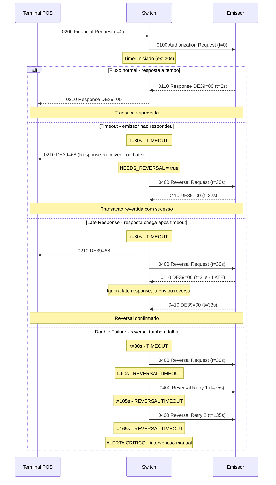

# Fase 4 — Reversal, Advice, Network Management (Semanas 13-16)

---

# Semana 13 — Reversões (0400/0410)

## 1. Quando reverter?

**Regra de ouro:** Se você tem dúvida se a transação foi efetivada no emissor → **REVERTA.**

| Cenário | Reversal? | Por quê? |
|---------|-----------|----------|
| Timeout sem resposta | **SIM** | Não sabe se emissor processou |
| Response DE39=96 (system malfunction) | **SIM** | Emissor pode ter processado parcialmente |
| Queda de conexão TCP durante envio | **SIM** | Não sabe se a mensagem chegou |
| Queda de conexão TCP após envio, antes da resposta | **SIM** | Não sabe se emissor processou |
| Response DE39=05 (do not honor) | **NÃO** | Resposta clara: negado |
| Response DE39=00 (approved) + erro no terminal ao imprimir | **SIM** | Portador não tem comprovante |
| Chip não validou ARPC | **SIM** | Chip rejeitou — transação inválida |

## 2. Anatomia do Reversal

```java
public class ReversalBuilder {

    private final AtomicLong stanCounter = new AtomicLong(0);

    public ISOMsg buildReversal(ISOMsg originalAuth) throws ISOException {
        ISOMsg reversal = new ISOMsg();
        reversal.setPackager(originalAuth.getPackager());
        reversal.setMTI("0400");

        // Copiar campos da transação original
        copyField(originalAuth, reversal, 2);   // PAN
        copyField(originalAuth, reversal, 3);   // Processing Code
        copyField(originalAuth, reversal, 4);   // Amount
        reversal.set(7, currentDateTime());      // NOVA data/hora (não a original)
        reversal.set(11, generateSTAN());        // NOVO STAN (não o original)
        copyField(originalAuth, reversal, 12);  // Local time original
        copyField(originalAuth, reversal, 13);  // Local date original
        copyField(originalAuth, reversal, 22);  // POS Entry Mode
        copyField(originalAuth, reversal, 25);  // POS Condition Code
        copyField(originalAuth, reversal, 32);  // Acquiring ID
        copyField(originalAuth, reversal, 37);  // RRN original
        copyField(originalAuth, reversal, 41);  // Terminal ID
        copyField(originalAuth, reversal, 42);  // Merchant ID
        copyField(originalAuth, reversal, 49);  // Currency

        // DE 90 — Original Data Elements (42 chars fixo)
        // Formato: MTI(4) + STAN(6) + DateTime(10) + AcqID(11) + FwdInstID(11)
        String de90 = originalAuth.getMTI()
            + originalAuth.getString(11)                              // STAN original
            + originalAuth.getString(7)                               // DateTime original
            + padLeft(getOrDefault(originalAuth, 32, "0"), 11, '0')  // Acquiring ID
            + padLeft("0", 11, '0');                                  // Forwarding ID
        reversal.set(90, de90);

        return reversal;
    }

    // ── Métodos auxiliares ─────────────────────────────────────────────────────

    /** Copia DE da mensagem origem para destino, somente se presente */
    private void copyField(ISOMsg src, ISOMsg dst, int de) throws ISOException {
        if (src.hasField(de)) {
            dst.set(de, src.getString(de));
        }
    }

    /**
     * Padding à esquerda com um caractere específico.
     * Ex: padLeft("123", 6, '0') → "000123"
     * Se str for mais longa que width, trunca pela DIREITA (pega os últimos 'width' chars).
     */
    private String padLeft(String str, int width, char padChar) {
        if (str == null) str = "";
        if (str.length() >= width) return str.substring(str.length() - width);
        StringBuilder sb = new StringBuilder(width);
        for (int i = str.length(); i < width; i++) sb.append(padChar);
        sb.append(str);
        return sb.toString();
    }

    /** Retorna valor do DE ou defaultVal se ausente */
    private String getOrDefault(ISOMsg msg, int de, String defaultVal) {
        try {
            return msg.hasField(de) ? msg.getString(de) : defaultVal;
        } catch (ISOException e) {
            return defaultVal;
        }
    }

    /** Data/hora atual no formato MMDDhhmmss (10 dígitos) */
    private String currentDateTime() {
        return DateTimeFormatter.ofPattern("MMddHHmmss")
                                .format(LocalDateTime.now());
    }

    /** Gera STAN sequencial com rollover em 999999 */
    private String generateSTAN() {
        return String.format("%06d", stanCounter.incrementAndGet() % 1_000_000);
    }
}
```

## 3. Auto-Reversal Engine

```java
public class AutoReversalEngine implements TransactionParticipant {
    
    private static final int MAX_RETRIES = 3;
    private static final long RETRY_INTERVAL_MS = 15000; // 15 segundos
    
    @Override
    public void abort(long id, Serializable context) {
        Context ctx = (Context) context;
        Boolean needsReversal = ctx.get("NEEDS_REVERSAL");
        
        if (Boolean.TRUE.equals(needsReversal)) {
            ISOMsg originalRequest = ctx.get("REQUEST");
            scheduleReversal(originalRequest, MAX_RETRIES);
        }
    }
    
    private void scheduleReversal(ISOMsg original, int retriesLeft) {
        // Em produção: usa fila persistente (não perde reversals se o switch cair)
        executor.schedule(() -> {
            try {
                ISOMsg reversal = reversalBuilder.buildReversal(original);
                ISOMsg response = mux.request(reversal, 45000);
                
                if (response == null && retriesLeft > 0) {
                    // Retry com backoff
                    scheduleReversal(original, retriesLeft - 1);
                } else if (response != null) {
                    String rc = response.getString(39);
                    if ("00".equals(rc) || "76".equals(rc)) {
                        // 00 = reversed, 76 = not found (ok, nunca processou)
                        log.info("Reversal successful for STAN {}", original.getString(11));
                    }
                }
            } catch (Exception e) {
                if (retriesLeft > 0) {
                    scheduleReversal(original, retriesLeft - 1);
                } else {
                    // ALERTA: reversal falhou após todas as tentativas
                    // Precisa de intervenção manual
                    alertOperations("REVERSAL_EXHAUSTED", original);
                }
            }
        }, RETRY_INTERVAL_MS, TimeUnit.MILLISECONDS);
    }
}
```

## 4. Timing Diagram — Timeout e Auto-Reversal

O diagrama abaixo mostra os exatos instantes em que cada evento ocorre, incluindo os casos de late response e double failure:



## 5. Exercícios Semana 13

1. **Implemente `ReversalBuilder`** com DE 90 montado corretamente
2. **Implemente `AutoReversalEngine`** com retry e backoff
3. **Teste:** auth timeout → reversal automático → response 00
4. **Teste:** auth timeout → reversal → emissor diz "76" (não encontrou) → OK
5. **Teste:** reversal que também dá timeout → retry
6. **Implemente persistência do reversal pendente** — o que acontece se o switch reiniciar antes do reversal ser confirmado? Use uma fila persistente (banco de dados ou arquivo) para que os reversals pendentes sobrevivam a um restart.

### Desafio
Simule: 0200 enviado, timeout, auto-reversal enviado... e **nesse momento** a response original (0210, DE39=00) chega (late response). O que fazer? Implemente a lógica e documente a decisão.

---

# Semana 14 — Advice e Retransmissão

## 1. Advice: o que é e quando usar

**Advice (MTI xx2x)** = "Eu já tomei a decisão, estou te avisando."

Diferente de request onde o emissor decide, no advice o remetente já decidiu. O receptor apenas confirma recebimento.

| MTI | Significado |
|-----|-------------|
| 0120 | Auth Advice — "Autorizei offline, estou avisando" |
| 0220 | Financial Advice — "Capturei a transação, confirmando" |
| 0420 | Reversal Advice — "Reverti localmente, estou avisando" |

## 2. Store-and-Forward (SAF)

Quando a comunicação cai, transações são armazenadas e enviadas como advice quando reconectar:

```
POS ←X→ Host (conexão caiu)

POS armazena localmente:
  [0220] Compra R$ 50 às 14:30
  [0220] Compra R$ 80 às 14:35
  [0220] Compra R$ 120 às 14:40

Conexão restaurada:
  POS → Host: 0220 (advice 1)
  Host → POS: 0230 (confirmação)
  POS → Host: 0220 (advice 2)
  Host → POS: 0230 (confirmação)
  POS → Host: 0220 (advice 3)
  Host → POS: 0230 (confirmação)
```

### 2.1 SAF no lado do switch (host-to-host)

O mesmo princípio se aplica entre o switch do adquirente e a bandeira. Se a conexão com a bandeira cair, o switch pode processar offline (stand-in) e enviar os advices em batch quando reconectar.

```java
public class SafQueue {

    private final BlockingDeque<SafEntry> queue;
    private final Path persistenceFile; // garante sobrevivência a restart

    public record SafEntry(ISOMsg advice, int retries, Instant enqueuedAt) {}

    public void enqueue(ISOMsg advice) {
        SafEntry entry = new SafEntry(advice, 0, Instant.now());
        queue.addLast(entry);
        persist(entry); // grava em disco imediatamente
    }

    /**
     * Drenagem após reconexão — chamada pelo ChannelHealthCheck
     * quando canal volta a ficar UP.
     */
    public void drain(MUX mux) {
        while (!queue.isEmpty()) {
            SafEntry entry = queue.peekFirst();

            // Descarta advices muito antigos (risco de inconsistência)
            if (Duration.between(entry.enqueuedAt(), Instant.now()).toHours() > 24) {
                queue.pollFirst();
                alertOperations("SAF_EXPIRED", entry.advice());
                continue;
            }

            try {
                ISOMsg response = mux.request(entry.advice(), 30_000);
                if (response != null && "00".equals(response.getString(39))) {
                    queue.pollFirst();
                    removePersisted(entry);
                } else {
                    // Backoff e retry
                    requeue(entry);
                    break;
                }
            } catch (Exception e) {
                requeue(entry);
                break;
            }
        }
    }

    private void requeue(SafEntry entry) {
        if (entry.retries() < 3) {
            queue.pollFirst();
            queue.addFirst(new SafEntry(entry.advice(), entry.retries() + 1, entry.enqueuedAt()));
        } else {
            // Desistiu após 3 tentativas — intervenção manual
            queue.pollFirst();
            alertOperations("SAF_EXHAUSTED", entry.advice());
        }
    }
}
```

### 2.2 Limites e riscos do SAF

| Risco | Mitigação |
|-------|-----------|
| Transação SAF chega após clearing já fechado | Timestamp de enqueue — descartar se > 23h |
| Portador contestar (chargeback) transação SAF não confirmada | Log de SAF com status é evidência |
| SAF enviado em duplicata após reconexão | Deduplicação por STAN + Terminal + Data |
| Queue SAF cresendo indefinidamente | Alerta quando queue > N itens; descarte por TTL |

## 3. Retransmissão vs Duplicata

```
Retransmissão legítima: MTI = xx1x (dígito 4 = 1)
  0201 = Financial Request Repeat
  O receptor DEVE retornar a mesma resposta anterior

Duplicata indevida: mesmo MTI, mesmo STAN, mesmo tudo
  O receptor precisa detectar e não processar duas vezes
```

## 4. Exercícios Semana 14

1. **Implemente tratamento de SAF** — fila local que drena quando canal reconecta
2. **Implemente detecção de retransmissão** — MTI xx1x retorna resposta cacheada
3. **Documente as diferenças** entre request, advice, e notification

### Desafio
O time de produção reporta: "O terminal TERM0088 está enviando a mesma transação 47 vezes (0201 repetido). O emissor está processando todas como novas."
Diagnostique e corrija. Onde está o bug? No terminal? No switch? No emissor?

---

# Semana 15 — Network Management (0800/0810)

## 1. Tipos de Network Management

| DE 70 | Função | Quando |
|-------|--------|--------|
| 001 | Sign-on | Início de sessão com o host |
| 002 | Sign-off | Fim de sessão |
| 101 | Key Change (ZPK) | Nova chave de PIN |
| 102 | Key Change (ZAK) | Nova chave de MAC |
| 201 | Cutover | Mudança de dia (virada) |
| 301 | Echo test | Verificar se o canal está vivo |

## 2. Health check de canal

```java
public class ChannelHealthCheck implements Runnable {
    private final QMUX mux;
    private final long interval = 30000; // 30s
    private volatile boolean channelHealthy = true;
    
    @Override
    public void run() {
        while (!Thread.interrupted()) {
            try {
                ISOMsg echo = buildEchoRequest();
                ISOMsg response = mux.request(echo, 10000);
                
                if (response != null && "00".equals(response.getString(39))) {
                    if (!channelHealthy) {
                        log.info("Channel recovered");
                        channelHealthy = true;
                        triggerSignOn(); // Re-logon após recovery
                    }
                } else {
                    channelHealthy = false;
                    alertOperations("CHANNEL_UNHEALTHY", mux.getName());
                }
                
                Thread.sleep(interval);
            } catch (Exception e) {
                channelHealthy = false;
            }
        }
    }
    
    public boolean isHealthy() { return channelHealthy; }
}
```

## 3. Exercícios Semana 15

1. **Implemente sign-on** (0800/DE70=001) obrigatório antes de enviar transações
2. **Implemente echo test** periódico com health status
3. **Bloqueie transações** se o canal não está logado (sign-on não feito ou falhou)
4. **Implemente cutover** (DE70=201) — simule virada de dia

### Desafio
Construa um dashboard (pode ser log estruturado) que mostra em tempo real:
- Status de cada canal (UP/DOWN/DEGRADED)
- Último echo test e latência
- Tempo desde o último sign-on bem-sucedido
- Número de transações bloqueadas por canal down

---

# Semana 16 — Deduplicação e Idempotência

## 1. O problema

```
Terminal envia 0200 (STAN=123456, PAN=4532..., AMT=15000)
Timeout — sem resposta
Terminal retransmite 0201 (STAN=123456, PAN=4532..., AMT=15000)
Emissor recebe AMBAS e processa DUAS vezes
Portador é cobrado R$ 300 em vez de R$ 150
```

## 2. Solução: Engine de Deduplicação

```java
public class DuplicateChecker implements TransactionParticipant {
    
    // Chave: combinação de campos que identifica a transação
    // Value: response anterior (ou timestamp)
    private final Cache<String, ISOMsg> recentTransactions;
    
    public DuplicateChecker() {
        this.recentTransactions = Caffeine.newBuilder()
            .expireAfterWrite(5, TimeUnit.MINUTES) // Janela de dedup
            .maximumSize(100_000)
            .build();
    }
    
    @Override
    public int prepare(long id, Serializable context) {
        Context ctx = (Context) context;
        ISOMsg msg = ctx.get("REQUEST");
        
        String dedupKey = buildDedupKey(msg);
        ISOMsg previousResponse = recentTransactions.getIfPresent(dedupKey);
        
        if (previousResponse != null) {
            // DUPLICATA DETECTADA
            log.warn("Duplicate detected: key={}", dedupKey);
            ctx.put("RESPONSE", previousResponse);
            ctx.put("IS_DUPLICATE", true);
            metrics.incrementDuplicateCount();
            return ABORTED; // Pula pro BuildResponse com a resposta anterior
        }
        
        ctx.put("DEDUP_KEY", dedupKey);
        return PREPARED;
    }
    
    @Override
    public void commit(long id, Serializable context) {
        // Após processar com sucesso, armazena para detecção futura
        Context ctx = (Context) context;
        String key = ctx.get("DEDUP_KEY");
        ISOMsg response = ctx.get("RESPONSE");
        if (key != null && response != null) {
            recentTransactions.put(key, response);
        }
    }
    
    private String buildDedupKey(ISOMsg msg) throws ISOException {
        // STAN + Terminal ID + Amount + PAN(last4) + Processing Code
        return msg.getString(11) + "|"
             + msg.getString(41) + "|"
             + msg.getString(4) + "|"
             + msg.getString(2).substring(msg.getString(2).length() - 4) + "|"
             + msg.getString(3);
    }
}
```

## 3. Exercícios Semana 16

1. **Implemente `DuplicateChecker`** com cache TTL de 5 minutos
2. **Teste:** mesma mensagem 2x → segunda retorna resposta cacheada
3. **Teste:** mensagem diferente (STAN diferente) → processa normalmente
4. **Teste:** mesma mensagem após TTL expirar → processa como nova
5. **Documente política de deduplicação:** quais campos compõem a chave e por quê

### Desafio
Implemente um teste que envia 1000 mensagens, das quais 10% são duplicatas intencionais. Verifique que:
- 900 foram processadas
- 100 foram detectadas como duplicatas
- Nenhuma duplicata gerou cobrança dupla
- O cache não estourou memória
