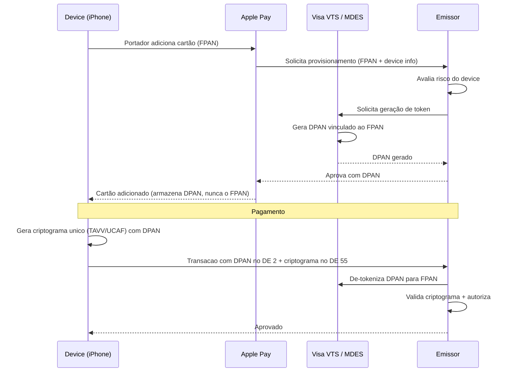

# Fase 5 — EMV, Segurança, Clearing e Settlement (Semanas 17-20)

---

# Semana 17 — EMV, Chip, Contactless e DE 55

## 1. TLV (Tag-Length-Value)

O DE 55 carrega dados do chip no formato TLV. Cada dado é uma "tag":

```
[Tag 9F26][Length 08][Value AABBCCDDEE112233]
[Tag 9F27][Length 01][Value 80]
[Tag 9F10][Length 07][Value 06010A03A4A000]

Concatenado:
9F2608AABBCCDDEE1122339F2701809F100706010A03A4A000
```

**Tag:** 1-3 bytes. Se os 5 bits inferiores do primeiro byte são todos 1 (0x1F), a tag é multi-byte.
**Length:** 1-3 bytes. Se bit 7 = 1, indica tamanho multi-byte (0x81 XX ou 0x82 XX XX).
**Value:** Os dados propriamente ditos.

## 2. Tags que você DEVE conhecer

| Tag | Nome | Bytes | O que faz |
|-----|------|-------|-----------|
| `9F26` | Application Cryptogram | 8 | Criptograma do chip (ARQC/TC/AAC) |
| `9F27` | Cryptogram Information Data | 1 | Tipo: 80=ARQC, 40=TC, 00=AAC |
| `9F10` | Issuer Application Data | var | Dados proprietários do emissor |
| `9F37` | Unpredictable Number | 4 | Anti-replay |
| `9F36` | Application Transaction Counter | 2 | Contador incremental |
| `95` | Terminal Verification Results | 5 | O que o terminal verificou |
| `9A` | Transaction Date | 3 | YYMMDD |
| `9C` | Transaction Type | 1 | 00=compra, 01=saque |
| `9F02` | Amount Authorized | 6 | Valor autorizado (BCD) |
| `9F1A` | Terminal Country Code | 2 | 076 = Brasil |
| `5F2A` | Transaction Currency Code | 2 | 0986 = BRL |
| `82` | Application Interchange Profile | 2 | Capacidades do app |
| `84` | Dedicated File Name (AID) | var | Application ID selecionado |
| `9F33` | Terminal Capabilities | 3 | O que o terminal suporta |
| `9F34` | CVM Results | 3 | Como portador foi verificado |

## 3. Fluxo ARQC → ARPC

```
1. Chip calcula ARQC (criptograma de request) usando:
   - Chave do chip (derivada da Master Key do emissor)
   - Dados da transação (valor, data, ATC, unpredictable number)
   
2. Terminal envia ARQC no DE 55 (tag 9F26)

3. Emissor (com HSM):
   - Deriva a mesma chave do chip
   - Recalcula o ARQC esperado
   - Se match → cartão é autêntico
   - Gera ARPC (resposta criptográfica)
   
4. ARPC volta no DE 55 da response

5. Chip valida ARPC:
   - Se OK → gera TC (Transaction Certificate) = transação confirmada
   - Se falha → gera AAC = transação rejeitada pelo chip
```

## 4. Parser TLV em Java

```java
public class TLVParser {
    
    public static Map<String, byte[]> parse(byte[] data) {
        Map<String, byte[]> tags = new LinkedHashMap<>();
        int offset = 0;
        
        while (offset < data.length) {
            // Tag
            int tagStart = offset;
            if ((data[offset] & 0x1F) == 0x1F) { // Multi-byte tag
                offset++;
                while (offset < data.length && (data[offset] & 0x80) != 0) offset++;
                offset++;
            } else {
                offset++;
            }
            String tag = bytesToHex(data, tagStart, offset - tagStart);
            
            // Length
            int length = 0;
            if (offset < data.length) {
                if ((data[offset] & 0x80) == 0) {
                    length = data[offset++] & 0x7F;
                } else {
                    int numBytes = data[offset++] & 0x7F;
                    for (int i = 0; i < numBytes; i++) {
                        length = (length << 8) | (data[offset++] & 0xFF);
                    }
                }
            }
            
            // Value
            if (offset + length <= data.length) {
                byte[] value = Arrays.copyOfRange(data, offset, offset + length);
                tags.put(tag.toUpperCase(), value);
                offset += length;
            } else break;
        }
        return tags;
    }
}
```

## 5. Exercícios Semana 17

1. **Implemente TLVParser** completo com testes
2. **Parse um DE 55 real** (use dados de exemplo) e identifique cada tag
3. **Implemente `DE55Analyzer`** que extrai e explica: tipo de criptograma, ATC, data, CVM usado
4. **Diferencie chip de fallback:** quando DE22=051 vs DE22=801, o que muda no DE55?

### Desafio
Receba dois dumps de DE 55 — um de transação chip e um de contactless. Compare tag a tag e documente as diferenças.

---

# Semana 18 — HSM, PIN, DUKPT e Segurança

## 1. Hierarquia de Chaves

```
HSM (Hardware Security Module)
  └── LMK (Local Master Key) — NUNCA sai do HSM
      └── ZMK (Zone Master Key) — compartilhada entre instituições
          ├── ZPK (Zone PIN Key) — criptografa PIN blocks
          ├── ZAK (Zone Auth Key) — calcula MAC
          └── ZEK (Zone Encryption Key) — criptografa dados
```

## 2. DUKPT (Derived Unique Key Per Transaction)

```
BDK (Base Derivation Key) — no HSM do adquirente
  └── IPEK (Initial PIN Encryption Key) — injetada no terminal
      └── Para cada transação:
          KSN (Key Serial Number) = Terminal ID + Contador
          Session Key = derive(IPEK, KSN)
          PIN Block criptografado = 3DES(Session Key, PIN Block claro)
```

**Vantagem:** Se uma chave de sessão vazar, só compromete aquela transação. Não afeta as demais.

## 3. PIN Translation

Quando a mensagem passa por um nó intermediário (processadora/bandeira):

```
Terminal → Adquirente:  PIN criptografado com ZPK-A
Adquirente → HSM:       "Traduza de ZPK-A para ZPK-B"
HSM:                     Descriptografa → re-criptografa
Adquirente → Bandeira:  PIN criptografado com ZPK-B
```

O PIN em claro NUNCA existe fora do HSM.

## 4. PAN Masking — PCI Mindset

```java
public class PANMasker {
    
    // Mostra apenas first 6 + last 4 (ou first 8 + last 4 com 8-digit BIN)
    public static String mask(String pan) {
        if (pan == null || pan.length() < 13) return "INVALID_PAN";
        int show = Math.min(6, pan.length() - 4);
        return pan.substring(0, show) 
             + "*".repeat(pan.length() - show - 4)
             + pan.substring(pan.length() - 4);
    }
    
    // Para logs: NUNCA logar PAN completo, track data, PIN, CVV
    public static String sanitizeForLog(ISOMsg msg) throws ISOException {
        StringBuilder sb = new StringBuilder();
        sb.append("MTI=").append(msg.getMTI());
        
        if (msg.hasField(2))  sb.append(" PAN=").append(mask(msg.getString(2)));
        if (msg.hasField(4))  sb.append(" AMT=").append(msg.getString(4));
        if (msg.hasField(11)) sb.append(" STAN=").append(msg.getString(11));
        if (msg.hasField(39)) sb.append(" RC=").append(msg.getString(39));
        if (msg.hasField(41)) sb.append(" TID=").append(msg.getString(41));
        // NUNCA logar: DE 35 (track), DE 52 (PIN), DE 55 raw
        
        return sb.toString();
    }
}
```

## 5. Exercícios Semana 18

1. **Implemente PIN Block Format 0** (gerar e validar)
2. **Implemente PANMasker** com testes extensivos
3. **Revise TODOS os logs do payment-switch-lab** — garanta que nenhum PAN completo, track ou PIN aparece
4. **Documente `security-policy.md`** com regras de logging, retenção, mascaramento

### Desafio
Faça um security audit no seu código: busque por qualquer lugar onde `msg.getString(2)`, `msg.getString(35)` ou `msg.getString(52)` é logado sem mascaramento. Corrija todos.

---

# Semana 19 — E-commerce, Credential on File, Tokenização

## 1. Card-Present vs Card-Not-Present

| Aspecto | CP (Presencial) | CNP (E-commerce) |
|---------|-----------------|-------------------|
| DE 22 | 051, 071 (chip) | 810, 012 (manual) |
| DE 25 | 00 (normal) | 08 (MOTO) ou 59 (e-com) |
| Autenticação | Chip + PIN | 3DS, OTP |
| Risco de fraude | Baixo | Alto |
| Interchange | Menor | Maior |
| Chargeback liability | Emissor (chip) | Merchant (sem 3DS) |

## 2. Credential on File (COF) — Framework Visa/Mastercard

Quando um merchant armazena os dados do cartão para cobranças futuras:

```
Transação inicial (CIT — Cardholder Initiated):
  Portador compra e autoriza armazenamento
  Bandeira retorna Network Transaction ID

Transações subsequentes (MIT — Merchant Initiated):
  Merchant cobra sem portador presente
  Usa Network TX ID da primeira transação como referência
  
DE 22 = 100 (credential on file)
DE 48 = indicadores COF (varia por bandeira)
```

## 3. Tokenização Network-Level — VTS e MDES

### 3.1 Por que tokenizar?

O PAN (número do cartão) é um dado sensível que circula em dezenas de sistemas: e-commerces, wallets, COF (Credential on File), terminais. Se qualquer um desses sistemas for comprometido, o PAN vaza.

A tokenização substitui o PAN real por um **token** que:
- É inútil fora do contexto para o qual foi gerado
- Pode ser invalidado sem cancelar o cartão
- Limita o escopo de uso (merchant específico, device específico, canal específico)

### 3.2 Arquitetura de tokenização

```
FPAN (Funding PAN): 4532 0151 1283 0366  ← número real do cartão
DPAN (Device/Digital PAN): 4532 9999 8888 7777  ← token

Visa Token Service (VTS) / Mastercard MDES
┌─────────────────────────────────────────────────┐
│  Token Vault                                    │
│  DPAN 4532 9999 8888 7777 → FPAN 4532 0151... │
│  Scope: Apple Pay, Device ABC, Merchant ANY     │
└─────────────────────────────────────────────────┘
```

### 3.3 Fluxo de provisionamento (Apple Pay / Google Pay)



### 3.4 Impacto no ISO 8583

| Campo | Valor com FPAN | Valor com DPAN (token) |
|-------|---------------|----------------------|
| DE 2 | 4532 0151 1283 0366 | 4532 9999 8888 7777 |
| DE 22 | 051 (chip) | 072 (contactless com token) |
| DE 55 (tag 9F26) | ARQC baseado no FPAN | TAVV/DCVV baseado no DPAN |
| DE 48 | Dados normais | Token requestor ID |

### 3.5 Tipos de tokens

| Tipo | Escopo | Exemplo |
|------|--------|---------|
| **Device Token** | Merchant ANY + Device específico | Apple Pay, Google Pay |
| **Merchant Token** | Merchant específico + Device ANY | COF em Amazon |
| **Secure Element Token** | Hardware específico (NFC) | Cartão contactless |
| **Cloud Token** | Armazenado remotamente | Samsung Pay (alguns casos) |

### 3.6 Account Updater

Quando um cartão expira ou é reemitido, o PAN/data de validade muda. Para merchants com COF, isso quebraria as cobranças recorrentes. O **Account Updater** resolve isso:

```
Merchant tem no COF:
  PAN: 4532 0151 1283 0366
  Exp: 11/2024

Cartão expira → Itaú emite novo:
  PAN: 4532 0151 1283 0366 (mesmo PAN, nova data)
  Exp: 11/2027

Merchant consulta Account Updater (batch mensal):
  Envia PANs/exp armazenados → recebe updates

Visa: Visa Account Updater (VAU)
Mastercard: Automatic Billing Updater (ABU)
```

Para tokens DPAN, o Account Updater é transparente — o token permanece válido mesmo quando o FPAN subjacente é renovado.

## 4. Exercícios Semana 19

1. **Implemente distinção CP/CNP** no ValidateMessage participant
2. **Documente `cnp-and-cof.md`** com os campos que mudam em e-commerce
3. **Crie cenário de recurring** — primeira transação + 3 cobranças subsequentes com COF
4. **Implemente lógica de 3DS** como flag no DE 22 (82 = e-com com 3DS autenticado)

### Desafio
Modele o fluxo completo de uma assinatura mensal de streaming:
- Mês 1: Portador cadastra cartão (CIT)
- Mês 2-12: Cobranças automáticas (MIT)
- Mês 6: Cartão expira e é renovado (Account Updater)
- Mês 8: Portador contesta (chargeback)
Quais mensagens ISO 8583 são trocadas em cada etapa?

---

# Semana 20 — Clearing, Settlement e Reconciliação

## 1. O ciclo completo

```
Dia 0:   Autorização (real-time, ISO 8583)
Dia 0:   Capture/batch close (end of day)
Dia 1:   Clearing (batch file, adquirente → bandeira → emissor)
Dia 2:   Settlement (movimentação financeira via câmara)
Dia 30:  Pagamento ao merchant (crédito D+30, ou antecipado)
```

## 2. Clearing files

**Visa — TC (Transaction Clearing) files:**
- TC05: Original presentment
- TC07: Fee collection
- Formato: posicional, registros de ~200 campos

**Mastercard — IPM (Integrated Products Messages):**
- DE-based (similar a ISO 8583, mas para clearing)
- Cada registro tem seu próprio "MTI" de clearing

## 3. Mismatches comuns

| Mismatch | Causa | Impacto |
|----------|-------|---------|
| Auth R$100, Clearing R$115 | Gorjeta (restaurante) | Normal em DMS |
| Auth R$100, Clearing R$80 | Partial capture | Normal |
| Auth sem clearing | Merchant não capturou | Auth expira (7-30 dias) |
| Clearing sem auth | Force post | Exceção — multa possível |
| Clearing com PAN diferente | Erro de sistema | Exceção grave |

## 4. Reconciliação

```java
public class ReconciliationEngine {
    
    public List<ReconciliationException> reconcile(
            List<AuthRecord> authorizations,
            List<ClearingRecord> clearings) {
        
        List<ReconciliationException> exceptions = new ArrayList<>();
        
        // Index auths by RRN
        Map<String, AuthRecord> authByRRN = authorizations.stream()
            .collect(Collectors.toMap(AuthRecord::rrn, Function.identity()));
        
        for (ClearingRecord clearing : clearings) {
            AuthRecord auth = authByRRN.get(clearing.rrn());
            
            if (auth == null) {
                // Clearing sem auth — Force Post
                exceptions.add(new ReconciliationException(
                    "CLEARING_WITHOUT_AUTH", clearing));
                continue;
            }
            
            if (!auth.amount().equals(clearing.amount())) {
                // Amount mismatch
                exceptions.add(new ReconciliationException(
                    "AMOUNT_MISMATCH", auth, clearing,
                    "Auth=" + auth.amount() + " Clearing=" + clearing.amount()));
            }
            
            authByRRN.remove(clearing.rrn()); // Matched
        }
        
        // Auths sem clearing
        for (AuthRecord unmatched : authByRRN.values()) {
            if (unmatched.isExpired()) {
                exceptions.add(new ReconciliationException(
                    "AUTH_WITHOUT_CLEARING_EXPIRED", unmatched));
            }
        }
        
        return exceptions;
    }
}
```

## 5. Exercícios Semana 20

1. **Implemente ReconciliationEngine** com detecção de 4+ tipos de mismatch
2. **Gere dados sintéticos** de auth e clearing com mismatches intencionais
3. **Crie relatório de exceções** com classificação e severidade
4. **Documente `post-auth-lifecycle.md`** com o ciclo completo

### Desafio
Explique por escrito (para um analista financeiro não-técnico) por que uma transação autorizada em R$ 200,00 pode aparecer no clearing como R$ 185,00 e isso ser completamente legítimo. Dê 3 cenários diferentes.
