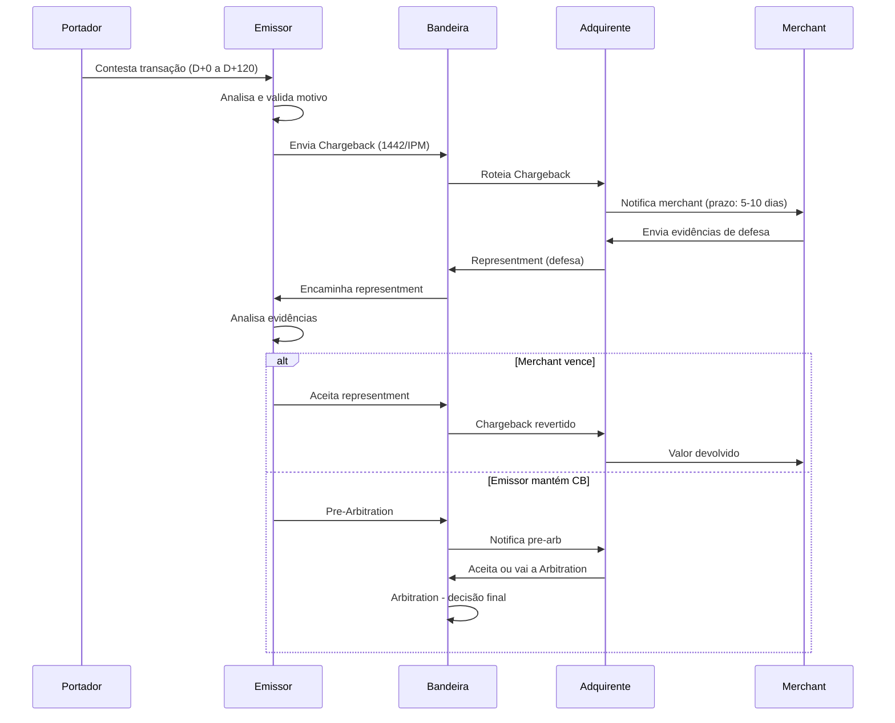

# Semana 29 — Chargebacks: Fundamentos e Ciclo de Vida

## Por que esta semana existe?

Você passou 28 semanas aprendendo como uma transação **aprovada** funciona. Agora chegou a hora de entender o que acontece quando ela é **contestada**. Chargeback é um dos temas que mais gera custo operacional, litígios e multas no ecossistema — e que a maioria dos desenvolvedores de pagamentos nunca estudou a fundo.

Entender chargebacks é obrigatório para quem trabalha em:
- Switch (impacto direto na decisão de autorização)
- Adquirência (responsabilidade operacional e financeira)
- Emissão (processo de disputa do lado do portador)
- Antifraude (chargeback é o sinal definitivo de fraude)

---

## 1. O que é Chargeback?

**Chargeback** é o processo pelo qual um portador contesta uma transação junto ao seu emissor, e o emissor — após análise — debita o valor de volta do adquirente.

Não confunda:

| Conceito | Quem inicia | Motivo | Impacto financeiro |
|----------|-------------|--------|-------------------|
| **Reversal (0400)** | Adquirente ou switch | Falha técnica, timeout | Automático, antes do clearing |
| **Void** | Merchant | Cancelamento no mesmo dia | Antes do clearing |
| **Refund/Estorno** | Merchant | Devolução voluntária | Após clearing, crédito ao portador |
| **Chargeback** | Portador/Emissor | Contestação formal | Débito forçado no adquirente |

O chargeback é o único mecanismo em que o **emissor debita o adquirente sem consentimento do merchant**.

---

## 2. Os Atores no Processo de Disputa

```
PORTADOR ──► EMISSOR ──► BANDEIRA ──► ADQUIRENTE ──► MERCHANT
   (1)          (2)         (3)            (4)           (5)
Contesta    Analisa e    Processa       Notifica e    Responde ou
transação   envia CB     e roteia       defende       aceita
```

**Portador (Cardholder):**
- Inicia a disputa ligando para o banco ou pelo app
- Tem prazo de 60 a 120 dias da data da transação (varia por bandeira)
- Precisa ter motivo válido (não pode contestar "arrependimento" em qualquer caso)

**Emissor (Issuer):**
- Avalia se a contestação é procedente
- Se proceder, emite o chargeback (MTI 1442 no Visa, formato IPM no Mastercard)
- Credita provisoriamente o portador enquanto a disputa tramita
- Tem prazo de 30 dias para enviar o chargeback ao adquirente

**Bandeira:**
- Roteia o chargeback do emissor para o adquirente correto
- Garante os prazos e o processo (quem não responde, perde)
- Em arbitration, é o árbitro final

**Adquirente:**
- Recebe o chargeback, notifica o merchant
- Pode defender a transação (representment) se tiver evidências
- Assume prejuízo se não defender ou perder a defesa
- Monitora chargeback ratio para evitar multas da bandeira

**Merchant:**
- Recebe notificação do adquirente
- Fornece evidências de defesa (comprovante, log, entrega confirmada)
- Se o chargeback ratio ultrapassar o limite, entra em programa de monitoramento

---

## 3. Ciclo de Vida Completo



---

## 4. Reason Codes — Visa

A Visa organiza os reason codes em 4 categorias. Conhecer os códigos é essencial para decidir como defender.

### 10.x — Fraude

| Código | Nome | Quando ocorre |
|--------|------|---------------|
| 10.1 | EMV Liability Shift — Counterfeit Fraud | Cartão clonado (tarja) usado em terminal com chip |
| 10.2 | EMV Liability Shift — Lost/Stolen | Cartão perdido/roubado usado em terminal sem chip |
| 10.3 | Other Fraud — Card Present | Fraude presencial sem classificação específica |
| 10.4 | Other Fraud — Card Absent | Fraude em e-commerce (CNP) |
| 10.5 | Visa Fraud Monitoring Program | Merchant em programa de monitoramento de fraude |

**EMV Liability Shift** é o conceito mais importante aqui:
- Se o **terminal não suporta chip** e o cartão tem chip → **responsabilidade é do adquirente**
- Se o **cartão não tem chip** e o terminal tem chip → **responsabilidade é do emissor**
- Isso criou incentivo para todos migrarem para chip

### 11.x — Autorização

| Código | Nome | Quando ocorre |
|--------|------|---------------|
| 11.1 | Card Recovery Bulletin | Cartão estava na lista de cancelados (hoje raramente usado) |
| 11.2 | Declined Authorization | Transação processada apesar de decline |
| 11.3 | No Authorization | Transação sem autorização prévia |

### 12.x — Erros de Processamento

| Código | Nome | Quando ocorre |
|--------|------|---------------|
| 12.1 | Late Presentment | Clearing enviado fora do prazo (geralmente > 7 dias da auth) |
| 12.2 | Incorrect Transaction Code | Débito/crédito codificado incorretamente |
| 12.3 | Incorrect Currency | Moeda errada na transação |
| 12.4 | Incorrect Account Number | PAN incorreto no clearing |
| 12.5 | Incorrect Amount | Valor diferente do autorizado (além da tolerância) |
| 12.6 | Duplicate Processing | Mesma transação processada duas vezes |
| 12.7 | Invalid Data | Dados inválidos no clearing |

### 13.x — Disputas do Portador

| Código | Nome | Quando ocorre |
|--------|------|---------------|
| 13.1 | Merchandise/Services Not Received | Produto não entregue ou serviço não prestado |
| 13.2 | Cancelled Recurring Transaction | Cobrança após cancelamento de assinatura |
| 13.3 | Not as Described or Defective | Produto diferente do anunciado ou defeituoso |
| 13.4 | Counterfeit Merchandise | Produto falsificado |
| 13.5 | Misrepresentation | Anúncio enganoso |
| 13.6 | Credit Not Processed | Refund prometido mas não creditado |
| 13.7 | Cancelled Merchandise/Services | Serviço cancelado mas cobrado |
| 13.8 | Original Credit Transaction Not Accepted | Crédito original rejeitado |
| 13.9 | Non-Receipt of Cash or Load Transaction | Saque ATM sem dispensa de dinheiro |

---

## 5. Reason Codes — Mastercard

Mastercard usa nomenclatura diferente mas conceitos similares:

| Código | Nome | Equivalente Visa |
|--------|------|-----------------|
| 4853 | Cardholder Dispute | 13.x |
| 4855 | Goods or Services Not Provided | 13.1 |
| 4859 | Services Not Rendered | 13.1 |
| 4863 | Cardholder Does Not Recognize | 10.4 |
| 4870 | Chip Liability Shift | 10.1 / 10.2 |
| 4871 | Chip/PIN Liability Shift | 10.2 |
| 4999 | Domestic Chargeback Dispute | Específico Brasil/regional |

---

## 6. Prazos — O Relógio do Chargeback

Prazos são críticos. Quem não responde dentro do prazo **perde automaticamente**.

```
COMPRA
  │
  ▼
D+0 ──────────────────────────────────────────────► D+120
         Portador pode contestar (até 120 dias)

CHARGEBACK EMITIDO
  │
  ├── D+30: Adquirente recebe notificação
  │
  ├── D+30 a D+45: Prazo para Representment (defesa)
  │                (varia: Visa 30 dias, Master 45 dias)
  │
  └── D+45 a D+75: Pre-Arbitration / Arbitration
                    (se aceito: +10 dias para resposta)
```

**Consequence de não responder:**
- Chargeback é aceito automaticamente
- Valor é debitado do adquirente
- Adquirente debita do merchant
- Chargeback conta no ratio do merchant

---

## 7. Impacto no Chargeback Ratio

A bandeira monitora a **taxa de chargeback** (chargebacks / transações no mês):

### Visa Dispute Monitoring Program (VDMP)

| Programa | Threshold | Consequência |
|----------|-----------|--------------|
| Early Warning | CB ratio ≥ 0.65% **ou** ≥ 75 CBs/mês | Notificação |
| Standard | CB ratio ≥ 0.9% **ou** ≥ 100 CBs/mês | Avaliação mensal com multas |
| Excessive | CB ratio ≥ 1.8% **ou** ≥ 1.000 CBs/mês | Multas pesadas, possível descredenciamento |

### Mastercard Excessive Chargeback Program (ECP)

| Nível | Threshold | Multa |
|-------|-----------|-------|
| Excessive | CB ratio ≥ 1.5% **e** ≥ 100 CBs/mês | USD 1.000/mês |
| High Excessive | CB ratio ≥ 2.0% **e** ≥ 200 CBs/mês | USD 25.000/mês |

**Impacto para o adquirente:** se o merchant ultrapassar os limites por muito tempo, o adquirente pode ser obrigado a descredenciar o merchant — perdendo a receita.

---

## 8. Chargeback no Contexto Técnico ISO 8583

O chargeback não é apenas um processo financeiro — ele tem implicações técnicas diretas.

### 8.1 Mensagens envolvidas

```
AUTORIZAÇÃO:       0100 (request) / 0110 (response)
CHARGEBACK:        1442 (Visa — First Chargeback)
                   1442 (Visa — Pre-Arbitration)
REPRESENTMENT:     1240 (Visa — First Presentment/Representment)
```

No Mastercard o ciclo usa o formato **IPM (Interchange Processing Message)**, não exatamente ISO 8583 online, mas baseado no mesmo padrão de campos.

### 8.2 Campos ISO relevantes para chargeback

| Campo | Uso no chargeback |
|-------|------------------|
| DE 2 — PAN | Identifica a transação original |
| DE 4 — Amount | Valor contestado (pode ser parcial) |
| DE 11 — STAN | Rastreia transação original |
| DE 37 — RRN | Número de referência da transação original |
| DE 38 — Auth Code | Código de autorização original |
| DE 72 / DE 73 | Data e dados adicionais da transação original |
| DE 90 — Original Data Elements | MTI original, STAN, data, hora, IDs |

### 8.3 Rastreabilidade — por que o DE 37 (RRN) é crítico

O **Retrieval Reference Number (DE 37)** é o campo que permite rastrear toda a cadeia de uma transação, do POS ao emissor. Em um chargeback, o RRN é a chave primária que une:

```
Autorização (0100)  → RRN = "123456789012"
Clearing           → RRN = "123456789012"
Chargeback (1442)  → DE 90: Original RRN = "123456789012"
```

Se o RRN não foi preservado corretamente no switch, o chargeback não consegue ser linkado à transação original — gerando uma exceção de reconciliação.

### 8.4 Partial Chargeback

O portador pode contestar **parte do valor**:

```
Autorização: R$ 500,00
Portador contesta: R$ 200,00 (item não entregue de um pedido maior)

DE 4 no chargeback: 000000020000 (R$ 200,00)
```

O switch precisa suportar partial amounts — muitas implementações simples não suportam.

---

## 9. Friendly Fraud vs True Fraud

Esta distinção é operacionalmente crítica:

**True Fraud (Fraude Real):**
- Cartão roubado/clonado, portador não realizou a transação
- Chargeback procedente
- Custo vai para o responsável pelo liability shift

**Friendly Fraud:**
- Portador **realizou** a transação mas contesta mesmo assim
- Pode ser:
  - "Arrependimento" disfarçado de "não recebi"
  - Filho/cônjuge usou o cartão sem autorização
  - Assinatura esquecida
- Merchant pode ganhar a disputa com evidências

**Como identificar Friendly Fraud:**
```
Evidências que provam que o portador recebeu:
  - Assinatura no comprovante (CNP: aceite de termos)
  - Confirmação de entrega com tracking + assinatura
  - Login do portador na plataforma + acesso ao produto digital
  - Histórico de compras similares do mesmo cartão
  - IP/device fingerprint
  - 3DS autenticado (elimina a maioria dos CBs de fraude CNP)
```

---

## 10. Como o Chargeback Impacta o Switch

Se você trabalha em um switch, estas são as implicações técnicas diretas:

**1. Preservar RRN e dados originais:**
```java
// O switch DEVE persistir dados suficientes para responder a CBs
public class TransactionRecord {
    String rrn;          // DE 37 — chave de rastreio
    String stan;         // DE 11
    String authCode;     // DE 38
    String pan;          // Mascarado (PCI) mas disponível para reconciliação
    String mti;
    String responseCode; // DE 39
    LocalDateTime txnDate;
    BigDecimal amount;
    String merchantId;   // DE 42
    String terminalId;   // DE 41
    String cardAcceptorData; // DE 43
    byte[] de55;         // EMV data — prova de chip transaction
    // Retenção mínima: 13 meses (Visa/Master requirement)
}
```

**2. Suportar retrieval requests:**
Antes do chargeback, o emissor pode enviar um **Retrieval Request** (MTI 1644) pedindo documentos da transação. O switch precisa responder com os dados originais.

**3. Logging imutável:**
Logs de transação devem ser imutáveis (append-only) e retidos pelo prazo regulatório. Em uma investigação de chargeback, o log é evidência.

---

## Resumo da Semana

| Conceito | O que você deve saber |
|----------|-----------------------|
| O que é chargeback | Débito forçado iniciado pelo portador, processado pelo emissor |
| Atores | Portador → Emissor → Bandeira → Adquirente → Merchant |
| Ciclo de vida | Disputa → Chargeback → Representment → Pre-Arb → Arbitration |
| Reason codes Visa | 10.x (Fraude), 11.x (Auth), 12.x (Processamento), 13.x (Disputa portador) |
| Reason codes Master | 4853, 4863, 4870, 4871 são os mais comuns |
| Prazos | Portador: até 120 dias; Adquirente: 30-45 dias para defender |
| Chargeback ratio | Visa: alerta em 0.65%; Mastercard: alerta em 1.5% |
| Impacto técnico | RRN como chave de rastreio, DE 90, retenção 13 meses |
| Friendly fraud | Portador realizou mas contesta — defensável com evidências |

---

## Exercícios Semana 29

1. **Classifique os cenários:**
   Para cada situação abaixo, indique se é reversal, void, refund ou chargeback, e quem inicia:
   - Cliente compra R$ 500 com cartão, switch não recebe resposta do emissor em 30s
   - Lojista erra o valor e cobra R$ 5.000 em vez de R$ 500, percebe na hora e cancela
   - Portador recebe o produto errado e liga para o banco 15 dias depois
   - Adquirente percebe que processou a mesma transação duas vezes no clearing
   - Portador cancela assinatura de streaming, mas no mês seguinte é cobrado novamente

2. **Reason code correto:**
   Indique o reason code Visa mais adequado para cada situação:
   - Portador afirma não ter feito a compra online (sem 3DS)
   - Terminal sem chip processou cartão com chip que foi clonado
   - Loja cobrou R$ 350 mas a autorização foi de R$ 300
   - Clearing do merchant chegou 12 dias após a autorização
   - Portador cancelou assinatura, merchant cobrou mesmo assim
   - Portador diz que o produto chegou completamente diferente do anunciado

3. **Calcule o chargeback ratio:**
   Um merchant processou em março:
   - 8.000 transações aprovadas
   - 42 chargebacks recebidos (dos quais 15 foram de transações de fevereiro)

   Qual é o chargeback ratio? O merchant está no VDMP? Em qual nível (Early Warning, Standard, Excessive)?

   Dica: o denominador é o total de transações do **mês de referência** (não o mês dos chargebacks).

4. **Rastreabilidade com RRN:**
   Analise o cenário:
   - Auth 0100 processada com STAN=001234, RRN=202403140001, DE39=00
   - Clearing enviado no D+1: RRN=202403140001, valor R$ 350
   - Chargeback recebido (reason code 12.5): valor contestado R$ 500

   Quais perguntas você precisa responder para defender essa transação? Que dados o switch precisa ter guardado? A defesa é viável — por quê?

5. **Partial chargeback — impacto técnico:**
   Um switch simples armazena `amount` como `long` (centavos). Um chargeback de R$ 200 chega referente a uma autorização de R$ 500.
   - O que o switch precisa verificar para aceitar o partial chargeback?
   - O que acontece com o restante (R$ 300) — continua liquidado?
   - Implemente o método `validatePartialChargebackAmount(long originalAmount, long chargebackAmount)` com as validações necessárias.

### Desafio — Análise de incidente

Você recebe um alerta: um merchant de e-commerce aumentou seu chargeback ratio de 0.3% para 2.1% em 30 dias. São 180 chargebacks recebidos, dos quais:
- 140 com reason code 10.4 (CNP fraud)
- 25 com reason code 13.1 (não recebido)
- 15 com reason code 12.6 (duplicata)

1. O merchant está em qual programa de monitoramento da Visa? Quais são as consequências imediatas?
2. Para os 140 CBs de fraude CNP: sem dados de 3DS, qual é a taxa realista de ganho no representment?
3. Para os 15 de duplicata: o que o switch deveria ter impedido? Qual mecanismo técnico faltou?
4. Que ação imediata você recomenda para o adquirente em relação a esse merchant?
5. Como o switch deveria ter gerado um alerta antes de chegar em 2.1%?
