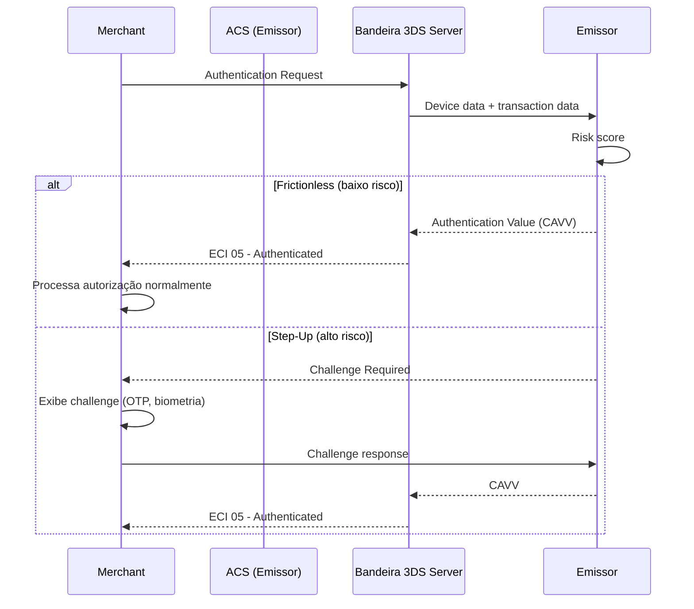

# Semana 30 — Representment, Prevenção e Operação de Disputes

## 1. Representment — A Arte da Defesa

**Representment** é o processo de re-apresentar uma transação ao emissor com evidências que provam que a transação foi legítima. É a principal ferramenta do adquirente/merchant para reverter um chargeback.

### 1.1 Quando representar?

Não represente todo chargeback automaticamente. Avalie:

```
┌─────────────────────────────────────────────────────────────┐
│            DECISÃO DE REPRESENTMENT                         │
├─────────────────────────────────────────────────────────────┤
│                                                             │
│  Tenho evidências sólidas?    ──► Não ──► Aceitar CB        │
│         │                                                   │
│        Sim                                                  │
│         │                                                   │
│  Valor > custo de defesa?     ──► Não ──► Aceitar CB        │
│  (considere tempo + taxa)                                   │
│         │                                                   │
│        Sim                                                  │
│         │                                                   │
│  Reason code defensável?      ──► Não ──► Aceitar CB        │
│  (10.4 sem 3DS = difícil)                                   │
│         │                                                   │
│        Sim                                                  │
│         │                                                   │
│         ▼                                                   │
│     REPRESENTAR                                             │
└─────────────────────────────────────────────────────────────┘
```

### 1.2 Documentação por Reason Code

| Reason Code | Documentação ideal |
|-------------|-------------------|
| 10.4 (CNP Fraud) | 3DS authentication data, device fingerprint, IP address, histórico do cliente |
| 13.1 (Não recebido) | Proof of delivery com assinatura, tracking confirmado, comunicação com cliente |
| 13.2 (Recorrência cancelada) | Termos de serviço assinados, prova de que o cancelamento NÃO foi solicitado antes da cobrança |
| 12.6 (Duplicata) | Prova de que são transações distintas (timestamps, valores, locais diferentes) |
| 13.3 (Produto diferente) | Fotos do produto enviado, descrição no site no momento da compra |
| 13.6 (Crédito não processado) | Comprovante do crédito processado com data e valor |

### 1.3 Evidências que vencem chargebacks de fraude CNP

A 3DS autenticação é a arma mais forte:

```
Sem 3DS:
  Portador contesta → Merchant perde (quase sempre)
  Liability: Adquirente/Merchant

Com 3DS Authenticated (ECI 05/02):
  Portador contesta → Merchant ganha (quase sempre)
  Liability: Emissor (fez a autenticação, responsabilidade é dele)

Com 3DS Attempted (ECI 06/01):
  Portador contesta → Merchant tem argumento, mas não é garantia
  Liability: compartilhada / depende do reason code
```

---

## 2. Pre-Arbitration e Arbitration

### 2.1 Pre-Arbitration

Se o emissor **rejeitar o representment**, o adquirente pode escalar para **Pre-Arbitration**:

- Última chance de resolução entre as partes
- Adquirente reenvia as evidências com documentação adicional
- Se o emissor aceitar: chargeback é revertido
- Se o emissor recusar: vai para Arbitration

**Custo de Pre-Arbitration:**
- Visa: USD 500 (cobrado de quem perder)
- Mastercard: USD 250 (cobrado de quem perder)

Faça o cálculo: só vale ir a pre-arb se o valor da transação + probabilidade de ganho superar o custo.

### 2.2 Arbitration

A **bandeira** decide. É o processo final e irrecorrível dentro do ecossistema de cartões:

```
Bandeira analisa:
  - Evidências do adquirente
  - Evidências do emissor
  - Compliance com as regras da bandeira

Possíveis resultados:
  - Adquirente ganha: chargeback revertido + emissor paga a fee
  - Emissor ganha: chargeback mantido + adquirente paga a fee
  - Split: raro, possível em casos específicos
```

**Custo de Arbitration:**
- Visa: USD 500 (+ USD 250 compliance fee se houver violação)
- Mastercard: USD 250

A maioria dos cases de arbitration é perdida pelo adquirente porque as evidências foram insuficientes nas etapas anteriores.

---

## 3. Ciclo Financeiro do Chargeback

```
COMPRA (D+0):
  Portador:    -R$ 0 (limite reservado)
  Merchant:    +R$ 0 (aguarda clearing)
  Adquirente:  neutro
  Emissor:     reserva limite

CLEARING (D+1):
  Merchant:    +R$ 970 (após MDR 3%)
  Adquirente:  +R$ 30 (MDR retido)
  Emissor:     -R$ 1.000 (débito no portador futuro)
  Bandeira:    +R$ 2 (assessment fee)

CHARGEBACK (D+X):
  Emissor:     +R$ 1.000 (debita do adquirente)
  Adquirente:  -R$ 1.000 (débito forçado)
  Adquirente:  -R$ 970 do merchant reserve (recupera do merchant)
  Merchant:    -R$ 970 (perde o que recebeu)

SE REPRESENTMENT GANHO:
  Adquirente:  +R$ 1.000 (revertido)
  Merchant:    +R$ 970 (devolvido)

CUSTO FINAL SEM REPRESENTMENT:
  Merchant:    perde R$ 970 + produto/serviço fornecido
  Adquirente:  lucro zero (MDR vai junto)
  Bandeira:    taxa de chargeback pode ser cobrada adicionalmente
```

---

## 4. Ferramentas de Prevenção

### 4.1 3D Secure (3DS)

O 3DS é o protocolo de autenticação para e-commerce que transfere a liability de fraude para o emissor.

**Versões:**
- **3DS 1.0:** Redirecionamento para página do banco (UX ruim, muito abandono)
- **3DS 2.0 (EMV 3DS):** Frictionless ou Step-Up baseado em risk score

**Fluxo 3DS 2.0:**


**ECI Values:**
| ECI | Significado | Liability |
|-----|-------------|-----------|
| 05 (Visa) / 02 (Master) | Fully authenticated | Emissor |
| 06 (Visa) / 01 (Master) | Attempted, emissor não suporta | Emissor (maioria) |
| 07 (Visa) / 00 (Master) | Not authenticated / Not attempted | Merchant |

### 4.2 CVV2 / CVC2

- Obrigatório para CNP
- Não pode ser armazenado após autorização (PCI DSS)
- DE 48 carrega o resultado da validação (não o código em si)

```
CVV2 Match Codes (DE 48, subelemento específico por bandeira):
  M = Match      → proceder
  N = No Match   → declinar (forte indicador de fraude)
  P = Not Processed → emissor não validou
  S = Should be on card → emissor afirma que não há CVV2
  U = Issuer not certified → emissor não participa
```

### 4.3 Address Verification Service (AVS)

Verificação de endereço de cobrança (usado principalmente nos EUA, mas disponível no Brasil):

```
AVS Response Codes (DE 44 / campo proprietário):
  Y = Address + ZIP match
  A = Address match, ZIP no match
  Z = ZIP match, address no match
  N = Neither match
  U = Unavailable
```

### 4.4 Velocity Rules

Regras de velocidade que o switch/antifraude deve implementar:

```java
public class VelocityRules {

    // Mesma cartão: máximo 3 tentativas em 10 minutos
    public boolean checkCardVelocity(String pan, int windowMinutes, int maxAttempts) { ... }

    // Mesmo dispositivo: máximo 5 cartões diferentes em 24h
    public boolean checkDeviceVelocity(String deviceId, int windowHours, int maxCards) { ... }

    // Mesmo IP: máximo 10 transações em 1 hora
    public boolean checkIpVelocity(String ip, int windowMinutes, int maxTxns) { ... }

    // Mesmo merchant + cartão: máximo 1 transação idêntica em 5 minutos
    public boolean checkDuplicateTransaction(String pan, String merchantId,
                                              BigDecimal amount, int windowMinutes) { ... }
}
```

### 4.5 MATCH (Master Alert to Control High-risk Merchants)

Lista negra da Mastercard de merchants descredenciados. Antes de credenciar um novo merchant, o adquirente **deve** consultar o MATCH:

- Merchant pode estar listado por excesso de chargebacks, fraude, ou violação de regras
- Adquirente que credencia merchant listado no MATCH pode ser multado
- Visa tem equivalente chamado VMAS (Visa Merchant Alert Service)

---

## 5. Operação de Disputes em Escala

### 5.1 Automação do processo

Para um adquirente com alto volume, o processo manual é inviável:

```java
public class DisputeAutomationEngine {

    public DisputeDecision evaluate(Chargeback cb) {

        // 1. Buscar transação original
        Transaction original = txnRepository.findByRrn(cb.getOriginalRrn());

        // 2. Verificar se vale defender (valor mínimo)
        if (original.getAmount().compareTo(MIN_DEFENSE_THRESHOLD) < 0) {
            return DisputeDecision.ACCEPT; // Não vale o custo operacional
        }

        // 3. Verificar reason code
        return switch (cb.getReasonCode()) {
            case "10.4" -> evaluate3dsEligibility(original, cb);
            case "12.6" -> evaluateDuplicateEvidence(original, cb);
            case "13.1" -> evaluateDeliveryEvidence(original, cb);
            case "13.2" -> evaluateRecurringCancellation(original, cb);
            default -> DisputeDecision.MANUAL_REVIEW;
        };
    }

    private DisputeDecision evaluate3dsEligibility(Transaction tx, Chargeback cb) {
        if (tx.getEci() != null && (tx.getEci().equals("05") || tx.getEci().equals("02"))) {
            return DisputeDecision.REPRESENT_AUTO; // 3DS autenticado = defesa forte
        }
        return DisputeDecision.ACCEPT; // Sem 3DS = sem defesa em CNP fraud
    }
}
```

### 5.2 SLAs operacionais

| Etapa | SLA interno | SLA bandeira |
|-------|-------------|-------------|
| Merchant recebe notificação | 24h após CB | N/A |
| Merchant envia evidências | 5 dias úteis | N/A |
| Adquirente envia representment | 7 dias úteis | 30 dias |
| Decisão de aceitar ou pre-arb | 5 dias úteis | 10 dias após resultado |

### 5.3 Dashboard de disputes

Métricas que o time de operações deve monitorar diariamente:

```
KPIs de Chargeback:
  - CB ratio por merchant (alert: > 0.65%)
  - CB ratio total (alert: > 0.5%)
  - Chargebacks por reason code (tendência)
  - Win rate do representment (meta: > 50%)
  - Valor em risco (CBs recebidos nos últimos 30 dias)
  - CBs sem resposta (perto do prazo)
  - Merchants no VDMP/ECP

Alarmes automáticos:
  - Merchant com > 10 CBs em 24h → investigar
  - CB ratio semanal > 1% → notificar gerência
  - Representment vencendo prazo em 48h → escalação
```

---

## 6. Chargebacks no Mercado Brasileiro

### 6.1 Particularidades da Elo

A Elo tem processo próprio de disputa chamado **CELO (Central Elo)** com algumas diferenças:

- Prazos ligeiramente diferentes de Visa/Master
- Reason codes próprios mas mapeáveis para Visa/Master
- Merchant pode ter processo simplificado de defesa para transações com senha digitada

### 6.2 BACEN e Regulação de Disputas

Desde 2020, o BACEN exige que emissores tenham processo de tratamento de reclamações de clientes com SLA definido. Isso impacta:

- Prazo máximo de crédito provisório ao portador: 10 dias úteis
- Notificação obrigatória ao portador sobre resultado
- Registro de reclamações no BACEN (ROCA)

### 6.3 Chargeback vs Contestação de Débito (Pix)

| Aspecto | Chargeback Cartão | MED (Pix) |
|---------|-------------------|-----------|
| Iniciador | Portador via emissor | Pagador via banco |
| Prazo para contestar | 60-120 dias | 80 dias |
| Reversibilidade | Processo estruturado | Depende do recebedor aceitar |
| Responsabilidade final | Merchant/adquirente | Mais complexo |
| Proteção ao consumidor | Mais robusta | Menor |

---

## 7. Chargeback e a Arquitetura do Switch

### 7.1 O que o switch deve garantir

```
1. RASTREABILIDADE COMPLETA
   - Cada transação deve ter RRN único e imutável
   - Todos os campos relevantes persistidos por 13+ meses
   - Logs append-only com timestamp imutável

2. SUPORTE A RETRIEVAL REQUEST (1644)
   - Switch deve responder a pedidos de documentação
   - Retornar dados originais da transação em até 15 dias

3. PARTIAL AMOUNTS
   - Suportar chargebacks de valor parcial (DE 4 < valor original)

4. LIFECYCLE TRACKING
   - Rastrear status: authorized → cleared → chargeback → representment → final

5. DUPLICATE DETECTION
   - Engine de deduplicação previne chargebacks 12.6
   - Janela de deduplicação: mínimo 24h para mesma transação
```

### 7.2 Modelo de dados para suportar disputes

```java
// Extensão do TransactionRecord para suporte a chargebacks
public class TransactionRecord {
    // Dados originais (imutáveis após criação)
    String rrn;                    // DE 37 — chave de rastreio
    String stan;                   // DE 11
    String authorizationCode;      // DE 38
    String maskedPan;              // PAN mascarado 6x4
    String mti;
    String responseCode;           // DE 39
    LocalDateTime txnDateTime;
    BigDecimal amount;
    String currency;               // DE 49
    String merchantId;             // DE 42
    String terminalId;             // DE 41
    String merchantName;           // DE 43
    String processingCode;         // DE 3
    String posEntryMode;           // DE 22
    byte[] emvData;                // DE 55 (completo)
    String eci;                    // E-commerce indicator
    String authenticationData;     // CAVV/3DS data
    boolean threedsAuthenticated;

    // Lifecycle (mutável)
    TransactionStatus status;      // AUTHORIZED, CAPTURED, REVERSED, CHARGEBACK
    LocalDateTime clearingDate;
    String chargebackRrn;          // RRN do chargeback, se ocorrer
    String chargebackReasonCode;
    DisputeStatus disputeStatus;   // RECEIVED, REPRESENTED, WON, LOST
    LocalDateTime disputeDeadline; // Prazo para representment
}
```

---

## Resumo da Fase 8

Você agora domina o ciclo completo de chargebacks e disputes:

| Conceito | Domínio esperado |
|----------|-----------------|
| Tipos de contestação | Distinguir reversal, refund e chargeback claramente |
| Reason codes | Identificar os 15+ reason codes mais comuns e suas implicações |
| Ciclo de vida | Navegar o processo do chargeback ao arbitration |
| Representment | Decidir quando e como defender com evidências corretas |
| 3DS e liability shift | Entender como 3DS muda a responsabilidade |
| Prevenção | CVV2, AVS, velocity rules, MATCH |
| Operação em escala | Automação, SLAs, dashboards |
| Brasil | Elo, BACEN, diferenças regulatórias |
| Arquitetura | O que o switch precisa garantir para suportar disputes |

---

## Exercícios Semana 30

1. **Decisão de representment:**
   Para cada chargeback abaixo, decida: representar, aceitar ou revisão manual. Justifique.
   - Valor: R$ 45. Reason code 10.4. Sem 3DS. Sem histórico do cliente.
   - Valor: R$ 3.800. Reason code 13.1. Entrega confirmada com código de rastreio + assinatura digital.
   - Valor: R$ 120. Reason code 13.2 (recorrência cancelada). Merchant não tem log de solicitação de cancelamento.
   - Valor: R$ 950. Reason code 10.4. 3DS com ECI=05 (fully authenticated).
   - Valor: R$ 200. Reason code 12.6 (duplicata). Merchant tem logs provando que são duas compras distintas com 3h de diferença.

2. **Calcule o break-even do representment:**
   Um adquirente recebe 500 chargebacks/mês com valor médio de R$ 280. O custo operacional de representment é R$ 35/caso (pessoal + sistemas). A taxa de win rate histórica é 38%.
   - Qual o valor mínimo de chargeback que vale a pena representar?
   - Quantos dos 500 chargebacks mensais deveriam ir a representment?
   - Qual o retorno financeiro esperado do programa de representment?

3. **Ciclo financeiro completo:**
   Uma transação de R$ 1.000 (MDR 2.8%, interchange 1.4%, assessment 0.2%) passa por:
   - Autorização aprovada (D+0)
   - Clearing + settlement (D+1/D+2)
   - Chargeback recebido 45 dias depois
   - Representment enviado e ganho

   Para cada etapa, calcule o saldo de cada ator (portador, merchant, adquirente, bandeira, emissor). Ao final, qual é o saldo líquido de cada um?

4. **Implemente o `DisputeAutomationEngine`:**
   Baseado no código da semana, estenda o `DisputeAutomationEngine` com:
   - `evaluate3dsEligibility()`: implementação completa com ECI 05/06/07
   - `evaluateDeliveryEvidence()`: recebe booleano `hasSignedDeliveryProof` e verifica se o valor supera `MIN_DEFENSE_THRESHOLD`
   - `evaluateDuplicateEvidence()`: verifica se timestamps das duas transações diferem por mais de 5 minutos (para evitar representar duplicatas reais)
   - Escreva testes unitários para cada cenário acima.

5. **Design do `TransactionRecord` para disputes:**
   Revise o modelo de dados da semana. Adicione os campos necessários para:
   - Responder a um Retrieval Request da bandeira (1644)
   - Suportar partial chargeback
   - Rastrear se 3DS foi realizado e com qual ECI
   - Armazenar o prazo de representment calculado automaticamente
   - Alertar quando um RRN está próximo do prazo (SLA 48h de antecedência)

### Desafio — Sistema de disputes end-to-end

Implemente um `ChargebackLifecycleService` que:

1. **Recebe um chargeback** (simulado como objeto `Chargeback` com RRN, reason code, valor):
   - Busca a transação original pelo RRN
   - Valida se o partial amount é ≤ ao valor original
   - Calcula o prazo de representment (30 dias para Visa, 45 para Mastercard)
   - Persiste o status inicial `CHARGEBACK_RECEIVED`

2. **Avalia automaticamente** se deve representar:
   - Chama o `DisputeAutomationEngine`
   - Se `REPRESENT_AUTO`: monta o representment e o envia (mock)
   - Se `ACCEPT`: debita do merchant e fecha
   - Se `MANUAL_REVIEW`: notifica o time de operações

3. **Gera alertas** diários:
   - Chargebacks a vencer em ≤ 48h sem resposta → alerta crítico
   - Merchant com chargeback ratio > 0.65% no mês → alerta de monitoramento

4. **Relatório mensal** com:
   - Total recebido, valor em risco, win rate, breakdown por reason code, merchants no threshold

Escreva testes de integração cobrindo os 3 caminhos principais do `evaluate()` e o alerta de vencimento.

---

## Resumo da Fase 8 — Consolidação

Ao terminar esta fase, você deve ser capaz de:

- **Explicar** a diferença entre reversal, void, refund e chargeback sem hesitar
- **Identificar** pelo reason code a estratégia de defesa correta
- **Calcular** chargeback ratio e determinar em qual programa de monitoramento um merchant se encontra
- **Decidir** quando representar e quando aceitar, com base em custo-benefício real
- **Projetar** o modelo de dados de um switch que suporte disputes, com retenção de 13 meses e rastreabilidade pelo RRN
- **Implementar** automação do ciclo de disputes com decisão por reason code, SLA tracking e alertas
